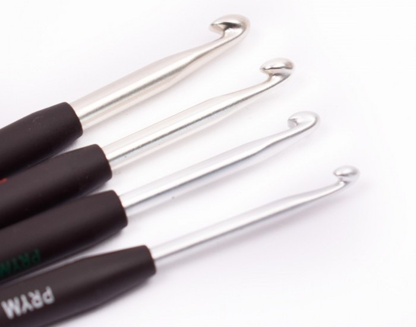

# Inuit Crochet

Ceci est mon espace public où je partage des patrons de ma création et tous les liens pour retrouver mes créations en crochet et comptes.

Vous trouverez une traduction anglaise à la fin de chaque pas quand celle ci est disponible.

## Liens

* [Inuit Crochet sur instagram](https://www.instagram.com/inuit_crochet/){:target="_blank" rel="noopener"}

## Patrons

* [Ariane 5](./patterns/Ariane5/Ariane5.md)

## Conseils et fournitures

### Crochets

J'utilise pour la plupart de mes ouvrages des crochets de taille 4. Mes préféres sont ceux de la marque Prym. Ils sont disponibles dans toutes les boutiques de loisirs créatifs et trouvable facilement sur Internet.

### Laine

Pour la laine j'ai trouvé mon bonheur avec les pelotes salsa de Cheval blanc. Celles ci sont 60% coton 40% acrylique ce qui est un très bon compromis et offre un rendu et un toucher très agréable.

Elles sont disponibles en pleins de colories différents [ici](https://www.laines-cheval-blanc.com/fr/fils-et-laines-ete/45-salsa.html)

### Changements de couleurs

Pour ceux qui ne connaissent pas il existe un petit tuto pour éviter les décalages lors des changements de couleur disponible [ici](https://www.youtube.com/watch?v=2KLlFhWrZYA){:target="_blank" rel="noopener"} 

## Licence

Tout mon travail est sous licence creative commons que vous pouvez trouver [ici](LICENCE.md).

Pour plus de détail vous pouvez vous rendre sur http://creativecommons.org/licenses/

# English version

This is the place where I put all my crochet patterns and links to find all my creations and socials.

You'll find an english translation at the bottom of each pages when avalable.

## Links

* [Inuit Crochet on instagram](https://www.instagram.com/inuit_crochet/){:target="_blank" rel="noopener"}

## Patterns

* [Ariane 5](./patterns/Ariane5/Ariane5.md)

## Advices and supplies

### Crochets

For most of my creation i use prym crochets of size 4. They are available on a lot of shops and easilly found on the Internet.

### Wool
And for the wool i love the salsa series of the brand Cheval Blanc. 60% cotton 40% acrylic good compromise and nice touch and result.

They are available [here](https://www.laines-cheval-blanc.com/fr/fils-et-laines-ete/45-salsa.html){:target="_blank" rel="noopener"} with a lot of colors

### Changing colors

There is a technique to avoid having ugly gaps when changing color you can find the tutorial in french [here](https://www.youtube.com/watch?v=2KLlFhWrZYA){:target="_blank" rel="noopener"} 

## Licence

All my work falls under creative commons licence than you can find [here](LICENCE.md).

For more details visit http://creativecommons.org/licenses/
