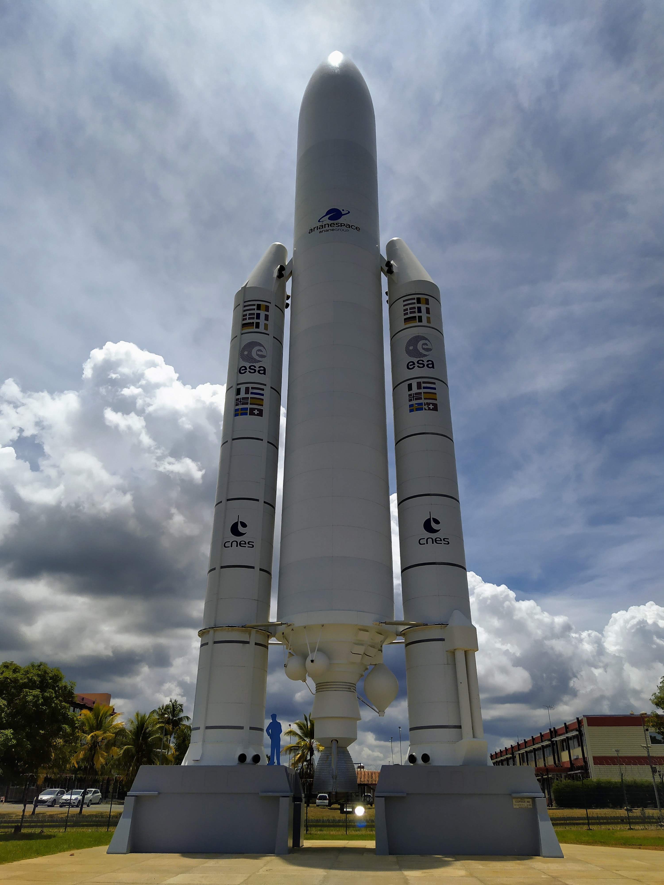

# Ariane 5

Ariane 5 est la fusée emblématique du centre spatial guyanais.

Vous trouverez sur cette page les liens vers des patrons de ma création autour de celle ci.

## Première version
Fusée Ariane 5 première version.

* [Français](./v1/fr/Ariane5.md)
* [Anglais](./v1/en/Ariane5.md)

## Deuxieme version
Fusée Ariane 5 deuxième version.

* [Français](./v2/fr/Ariane5.md)
* [Anglais](./v2/en/Ariane5.md)

# English version

Ariane 5 is the emblematic rocket of the centre spatial guyanais.

You'll find on this page crochet patterns I made for this

## First version

Ariane 5 Rocket pattern first version.

* [French](./v1/fr/Ariane5.md)
* [English](./v1/en/Ariane5.md)

## Second version

Ariane 5 Rocket pattern second version.

* [French](./v2/fr/Ariane5.md)
* [English](./v2/en/Ariane5.md)
