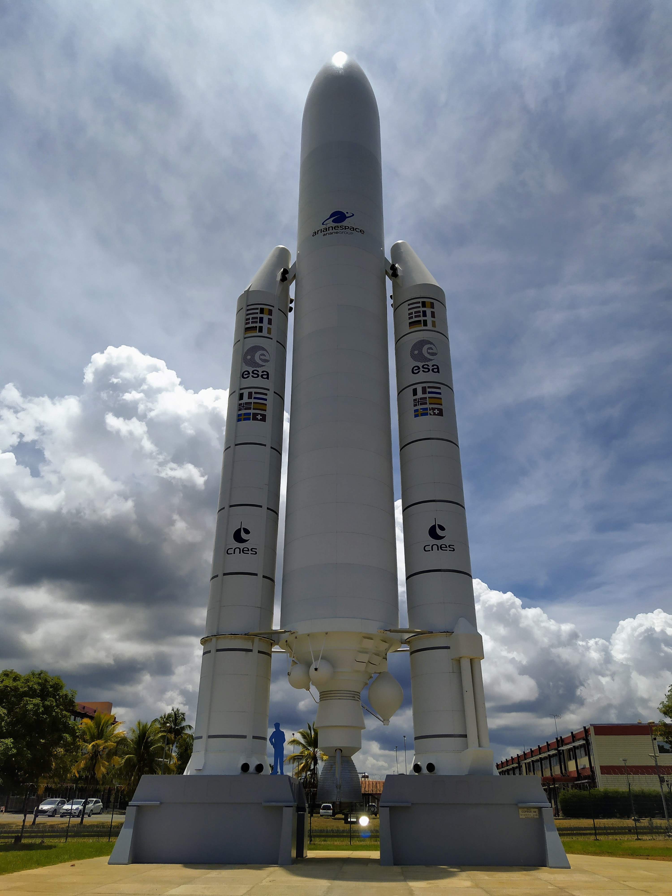

# Ariane 5

Ariane 5 est la fusée emblématique du centre spatial guyanais.

Ariane 5 is the emblmatic rocket of the centre spatial guyanais.

## Fisrt draft

Tentative de patron de fusée Ariane 5 Première version.

Attempt of Ariane 5 Rocket pattern fist version.

* [Français](./v1/fr/Ariane5.md)
* [English](./v1/en/Ariane5.md)