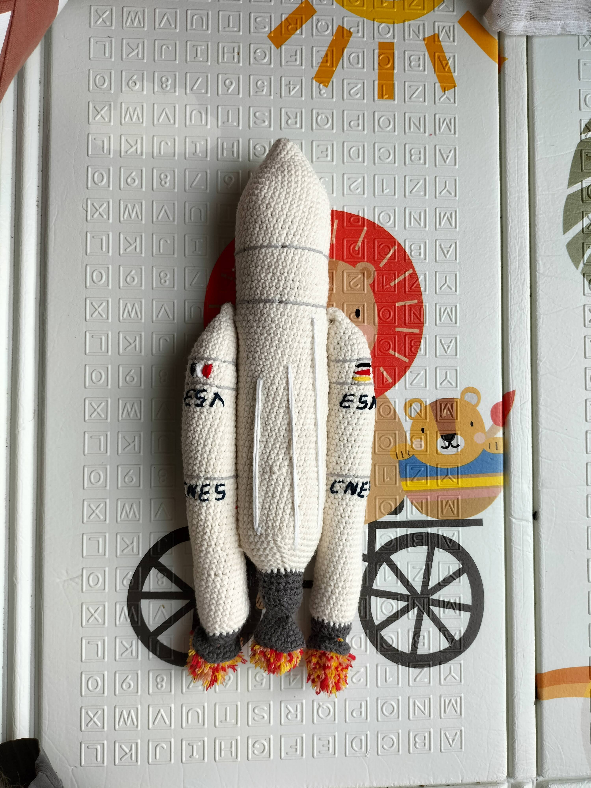
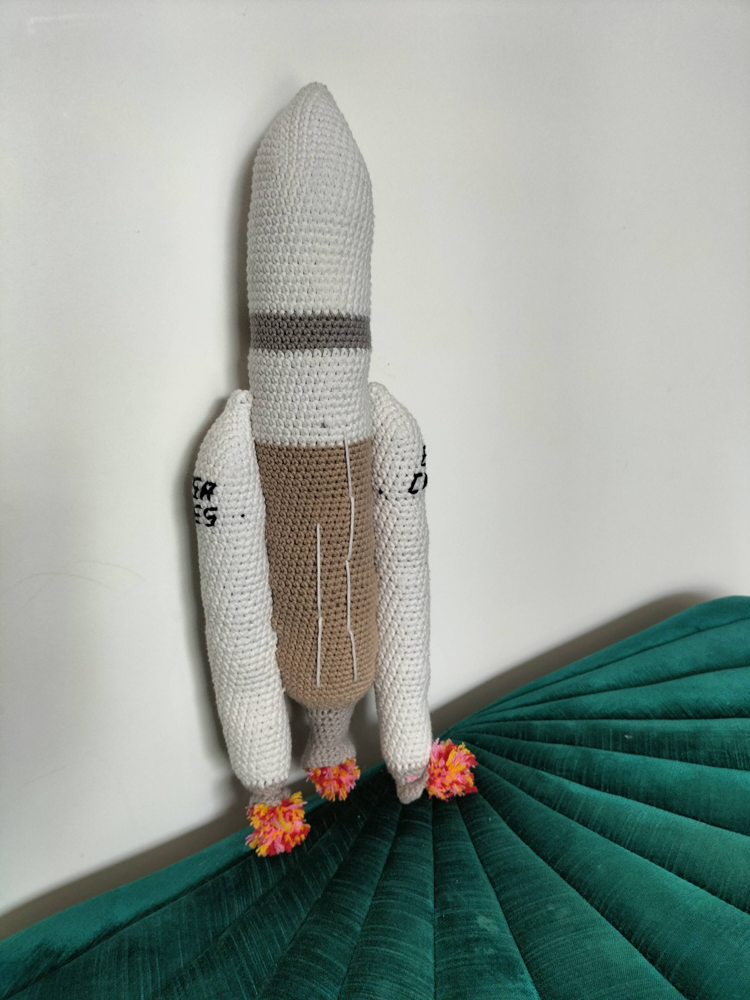

# Ariane 5

Ariane 5 est la fusée emblématique du centre spatial guyanais.

Vous trouverez sur cette page les liens vers des patrons de ma création autour de celle ci.



## Première version

Fusée Ariane 5 première version.

* [Français](./v1/fr/Ariane5.md)
* [Anglais](./v1/en/Ariane5.md)

## Deuxieme version

J'ai un peu amélioré le patron par la suite, vous trouverez une deuxieme version ci dessous.

* [Français](./v2/fr/Ariane5.md)
* [Anglais](./v2/en/Ariane5.md)



# English version

Ariane 5 is the emblematic rocket of the centre spatial guyanais.

You'll find on this page crochet patterns I made for this

If you like what I do you, you can [Buy me some yarn](https://buymeacoffee.com/inuitcrochet){:target="_blank" rel="noopener"}

## First version

Ariane 5 Rocket pattern first version.

* [French](./v1/fr/Ariane5.md)
* [English](./v1/en/Ariane5.md)

## Second version

The pattern has been upgraded afterwards, you can find it just under

* [French](./v2/fr/Ariane5.md)
* [English](./v2/en/Ariane5.md)

## Licence

All my work falls under creative commons licence than you can find [here](LICENCE.md).

For more details visit [creativecommons.org](http://creativecommons.org/licenses/){:target="_blank" rel="noopener"}

To make short you are free to use, share and modify my work but not for a professional purpose. And you have to reffer my Instagram or this blog when you share it.

You can also [buy me some wool](https://buymeacoffee.com/inuitcrochet){:target="_blank" rel="noopener"}

{:target="_blank" rel="noopener"}
