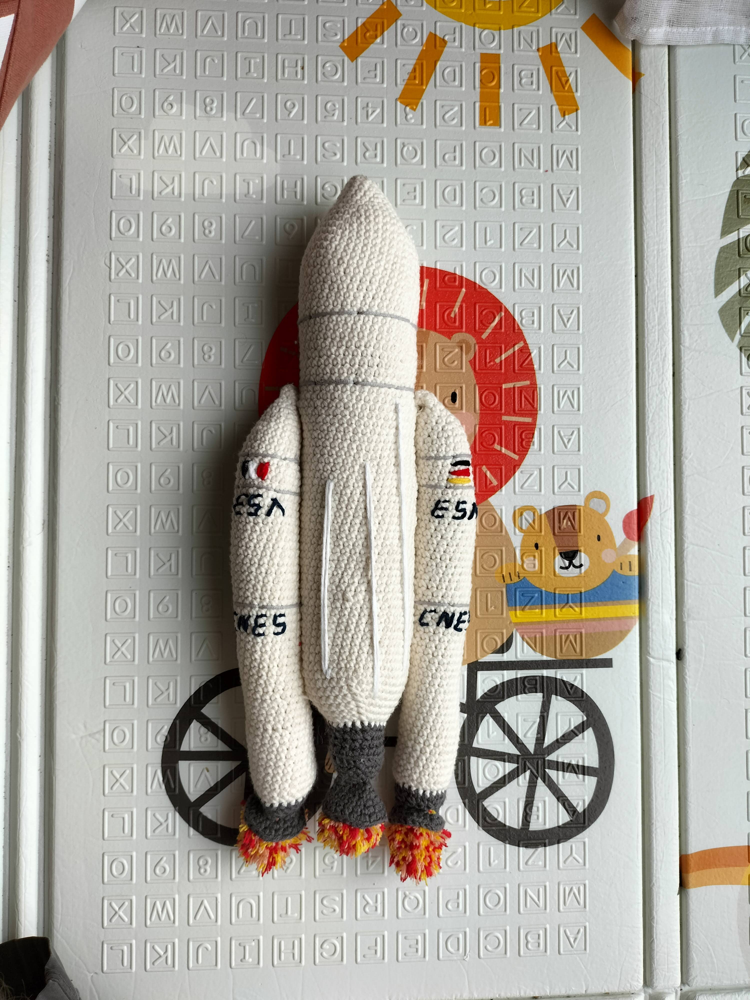
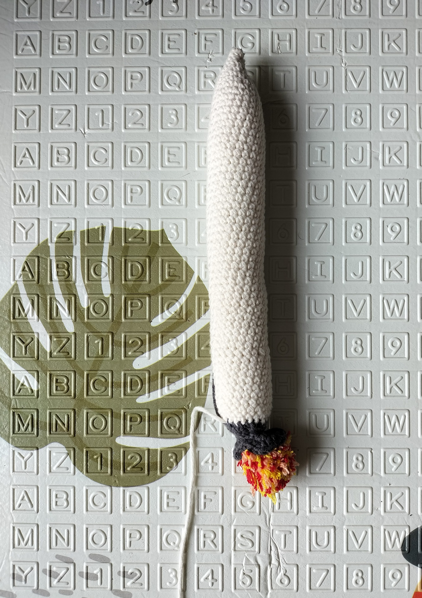
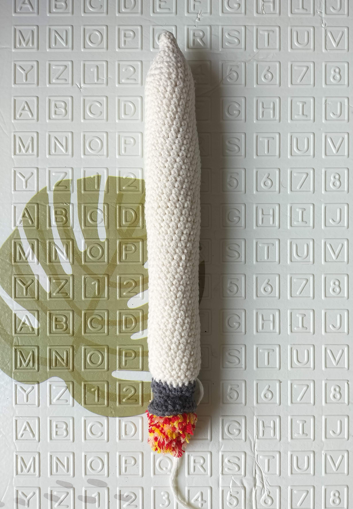

# Ariane 5 pattern first draft

This pattern will descrine how to do this Ariane 5 rocket replica that is 38cm high

## Terminology

I use abreviates in the pattern here are them to help you read the pattern

* Rnd : Round
* sc : Single crochet
* BLO : Back loop only
* inc : Increase
* dec : Decrease

For each round you'll find the number of the round, the instructions and the total number of stiches between parenthesis

## Supplies

* 1 crochet size 4
* 3 white ball of yarn
* 1 dark gray ball of yarn
* 1 pair of cissors
* 1 yarn needle
* padding

## Pattern

### Booster (x2)

Start by a 4 stich magic ring

* Rnd 1: 3 sc, 1 inc (5)
* Rnd 2: 3 sc, 2 inc (7)
* Rnd 3: 3 sc, (1 inc, 1 sc) x 2 (9)
* Rnd 4: 3 sc, (1 inc, 2 sc) x 2 (11)
* Rnd 5: 3 sc, (1 inc, 3 sc) x 2 (13)
* Rnd 6: 3 sc, (1 inc, 4 sc) x 2 (15)
* Rnd 7: 3 sc, (1 inc, 5 sc) x 2 (17)
* Rnd 8: 3 sc, (1 inc, 6 sc) x 2 (19)
* Rnd 9: 3 sc, (1 inc, 7 sc) x 2 (21)
* Rnd 10-45: 21 sc (21)

Stuff the tube with the padding.

* Rnd 46: (1 sc, 1 dec) x 7 (14) BLO
* Rnd 47: 8 dec (6)
Close leaving long tail to be able to attach it to the rocket body

Do the engine in grey

* Rnd 1 : 21 sc (21) In the front loops only of the round 46
* Rnd 2 : (1 sc, 1 dec) x 7 (14)
* Rnd 3 : 14 sc (14)
* Rnd 4 : (1 sc, 1 inc) x 7 (21)
* Rnd 5 : (2 sc, 1 inc) x 7 (28)
Stuff the engine up to the middle

Close and stop the work.

### Rocket body

Start by a 6 stich magic ring

* Rnd 1 : (1 sc, 1 inc) x 3 (9)
* Rnd 2 : (2 sc, 1 inc) x 3 (12)
* Rnd 3 : (3 sc, 1 inc) x 3 (15)
* Rnd 4 : (4 sc, 1 inc) x 3 (18)
* Rnd 5 : (5 sc, 1 inc) x 3 (21)
* Rnd 6 : (6 sc, 1 inc) x 3 (24)
* Rnd 7 : (7 sc, 1 inc) x 3 (27)
* Rnd 8 : (8 sc, 1 inc) x 3 (30)
* Rnd 9 : (9 sc, 1 inc) x 3 (33)
* Rnd 10 : (10 sc, 1 inc) x 3 (36)
* Rnd 11 : (11 sc, 1 inc) x 3 (39)
* Rnd 12 : (12 sc, 1 inc) x 3 (42)
* Rnd 13-68 : 42 sc (42)
* Rnd 69 : (12 sc, 1 dec) x 3 (39) 
* Rnd 70 : (11 sc, 1 dec) x 3 (36)
* Rnd 71 : (10 sc, 1 dec) x 3 (33)
* Rnd 72 : (9 sc, 1 dec) x 3 (30)
* Rnd 73 : (8 sc, 1 dec) x 3 (27)
* Rnd 74 : (7 sc, 1 dec) x 3 (24)
* Rnd 75: (2 sc, 1 dec) x 7 (21) BLO
* Rnd 76: (1 sc, 1 dec) x 7 (14)
* Rnd 77: 8 dec (6)
Close and stop the work.

Do the Vulcain engine in grey

* Rnd 1 : (6 sc, 1 dec) x 3 (21) In the front loops only of the round 75
* Rnd 2 : (5 sc, 1 dec) x 3 (18) 
* Rnd 3-4 : 18 sc (18)
* Rnd 5 : (4 sc, 1 dec) x3 (15)
* Rnd 6 : (1 sc, 1 dec) x5 (10)
* Rnd 7 : (2 sc, 1 inc) x3, 1sc (13)
* Rnd 8 : (3 sc, 1 inc) x3, 1sc (16)
* Rnd 9 : (4 sc, 1 inc) x3, 1sc (19)
* Rnd 10 : (5 sc, 1 inc) x3, 1sc (22)
Close and stop the work.

Stuff the engine up to the middle

## Possible Customizations

For a more realistic look I added pompoms to do the engine flames (with yellow, orange and red yarn)

I also added flags and logos
