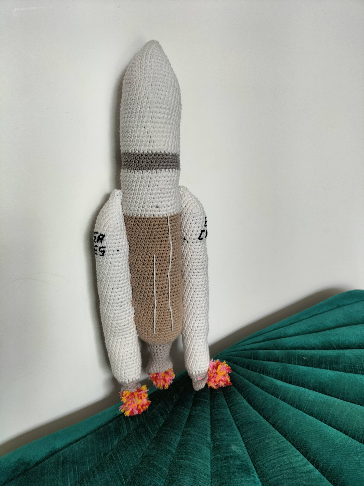
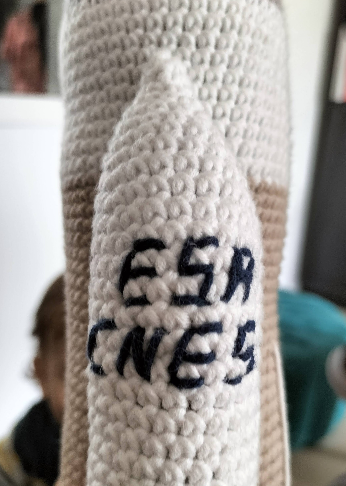
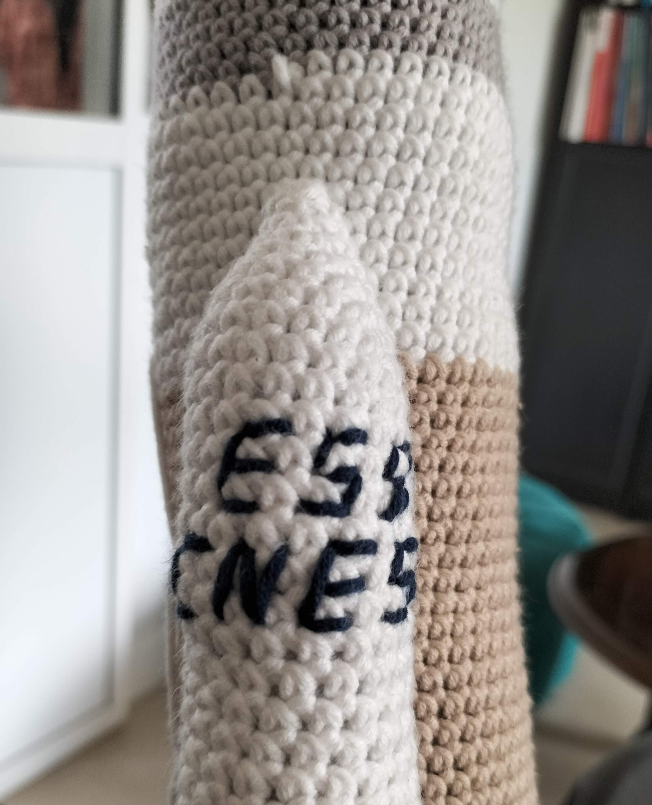

# Ariane 5

This pattern will describe how to do this Ariane 5 rocket replica that is 38cm high

Time needed: 8 hours

Difficulty: 2/5

## Terminology

I use abreviates in the pattern here are them to help you read the pattern

* Rnd : Round
* sc : Single crochet
* BLO : Back loop only
* FLO : Front loop only
* inc : Increase
* dec : Decrease

For each round you'll find the number of the round, the instructions and the total number of stiches between parenthesis

## Supplies

* 1 crochet size 4
* 2 white ball of yarn
* 1 ligh gray ball of yarn
* 1 beige ball of yarn
* 1 pair of cissors
* 1 yarn needle
* padding

For the wool I use the salsa one from cheval blanc brand and a crochet from Prym

## Ariane 5 Crochet Pattern

### Booster (x2)

Start by a 4 stich magic ring in white

* Rnd 1: 3  sc, 1 inc (5)
* Rnd 2: 3  sc, 2 inc (7)
* Rnd 3: 3  sc, (1 inc, 1  sc) x 2 (9)
* Rnd 4: 3  sc, (1 inc, 2  sc) x 2 (11)
* Rnd 5: 3  sc, (1 inc, 3  sc) x 2 (13)
* Rnd 6: 3  sc, (1 inc, 4  sc) x 2 (15)
* Rnd 7: 3  sc, (1 inc, 5  sc) x 2 (17)
* Rnd 8: 3  sc, (1 inc, 6  sc) x 2 (19)
* Rnd 9: 3  sc, (1 inc, 7  sc) x 2 (21)
* Rnd 10-45: 21  sc (21)

Stuff the tube with the padding.

* Rnd 46: (1  sc, 1 dec) x 7 (14) BLO
* Rnd 47: 8 dec (6)

Close leaving long tail to be able to attach it to the rocket body

Do the engine in grey

* Rnd 1 : 21  sc (21) FLO of round 46
* Rnd 2 : (1  sc, 1 dec) x 7 (14)
* Rnd 3 : 14  sc (14)
* Rnd 4 : (1  sc, 1 inc) x 7 (21)
* Rnd 5 : (2  sc, 1 inc) x 7 (28)

Stuff the engine up to the middle

Close and stop the work.

### Rocket Body

Start by a 6 stich magic ring in white

* Rnd 1 : (1  sc, 1 inc) x 3 (9)
* Rnd 2 : (2  sc, 1 inc) x 3 (12)
* Rnd 3 : (3  sc, 1 inc) x 3 (15)
* Rnd 4 : (4  sc, 1 inc) x 3 (18)
* Rnd 5 : (5  sc, 1 inc) x 3 (21)
* Rnd 6 : (6  sc, 1 inc) x 3 (24)
* Rnd 7 : (7  sc, 1 inc) x 3 (27)
* Rnd 8 : (8  sc, 1 inc) x 3 (30)
* Rnd 9 : (9  sc, 1 inc) x 3 (33)
* Rnd 10 : (10  sc, 1 inc) x 3 (36)
* Rnd 11 : (11  sc, 1 inc) x 3 (39)
* Rnd 12 : (12  sc, 1 inc) x 3 (42)
* Rnd 13-28 : 42  sc (42)

Change color for light gray

* Rnd 29-33 : 42  sc (42)

Change color for white

* Rnd 34-44 : 42  sc (42)

Change color for beige

* Rnd 45-84 : 42  sc (42)

Stuff the tube with the padding.
* Rnd 85: (5  sc, 1 dec) x 6 (36) BLO
* Rnd 86: (4  sc, 1 dec) x 6 (30)
* Rnd 87: (3  sc, 1 dec) x 6 (24)
* Rnd 88: (2  sc, 1 dec) x 6 (18)
* Rnd 89: (1  sc, 1 dec) x 6 (12)
* Rnd 90: 6 dec (6)

Close and stop the work.

Do the engine in grey

* Rnd 1 : 24  sc (24) FLO of round 87
* Rnd 2 : (6  sc, 1 dec) x 3 (21) 
* Rnd 3-4 : 21  sc (21)
* Rnd 5 : (5  sc, 1 dec) x3 (18)
* Rnd 6 : (4  sc, 1 dec) x3 (15)
* Rnd 7 : (3  sc, 1 dec) x3 (12)
* Rnd 8 : (3  sc, 1 inc) x3 (15)
* Rnd 9 : (4  sc, 1 inc) x3 (18)

Close and stop the work.

Stuff the engine up to the middle

## Assembly

Attach the boosters to the side of the rocket. The booster motors must be just under the Vulcan motor of the main rocket body.

Reffer to the full rocket picture for more details.

## Possible Customisations

For a more realistic look I added flames with scuplted pompoms (Using mixed red orange and yellow yarn)

I also added ESA and CNES in letters on the boosters.

## Licence

All my work falls under creative commons licence than you can find [here](LICENCE.md).

For more details visit [creativecommons.org](http://creativecommons.org/licenses/){:target="_blank" rel="noopener"}

To make short you are free to use, share and modify my work but not for a professional purpose. And you have to reffer my Instagram or this blog when you share it.

You can also [buy me some wool](https://buymeacoffee.com/inuitcrochet){:target="_blank" rel="noopener"}

{:target="_blank" rel="noopener"}
