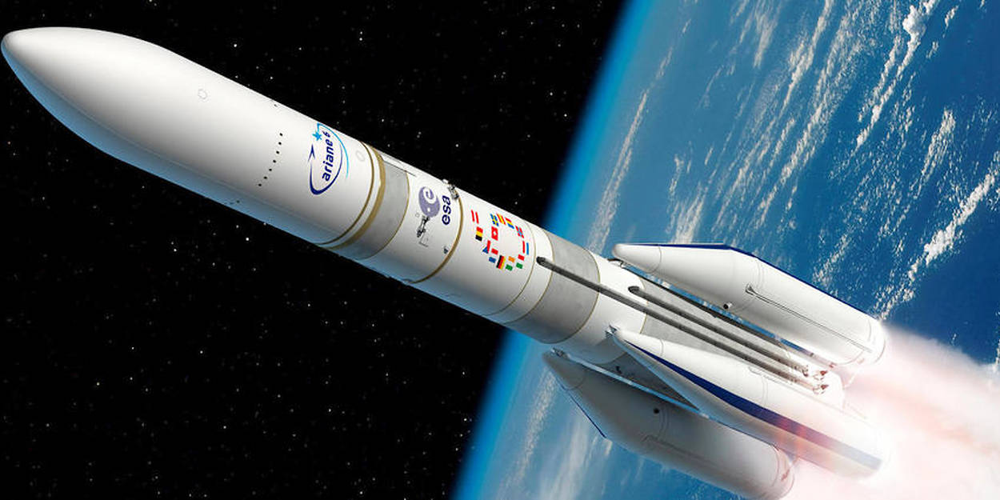
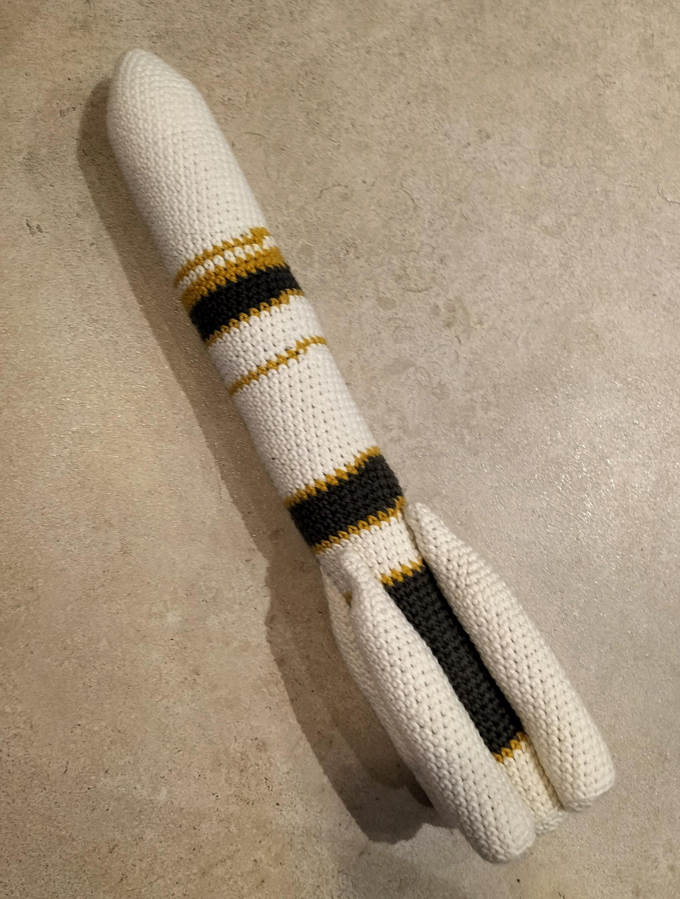
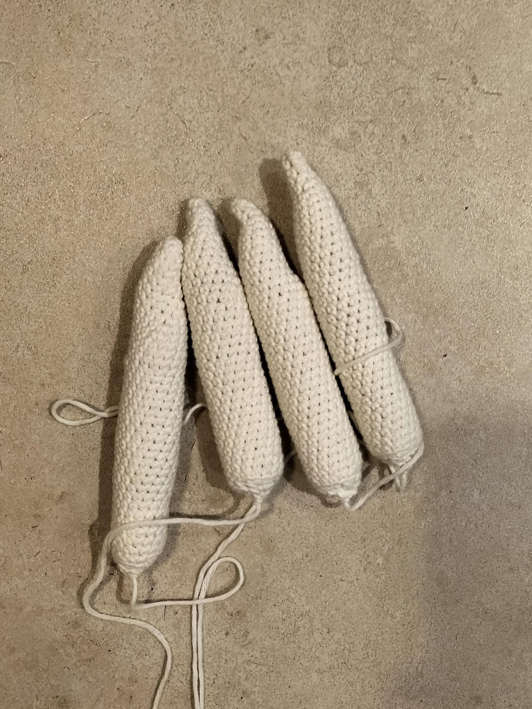
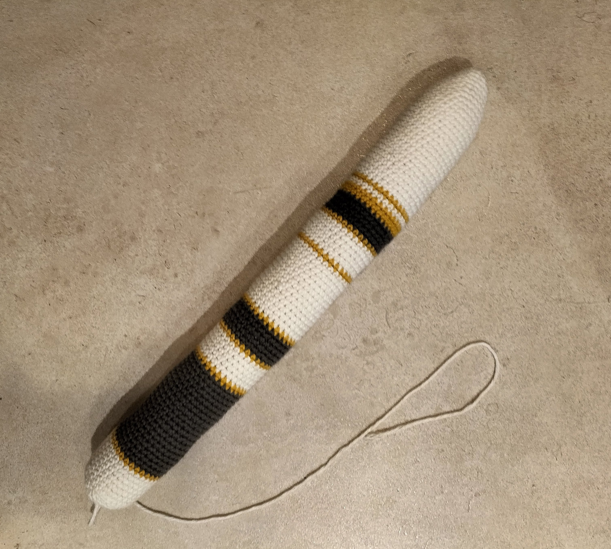

# Ariane 6

Ariane 6 est l'évolution de sa petite soeur Ariane 5 et le futur des lanceurs du centre spatial guyanais.

Vous trouverez sur cette page le patron de ma création qui s'en insipre.

Si vous aimez mon travail, vous pouvez me [payer de la laine](https://buymeacoffee.com/inuitcrochet)

# Patron Crochet Ariane 6

Ce patron permet de faire cette fusée Ariane de 44cm en version 2 ou 4 boosters

Temps nécessaire  : 8 heures

Difficulté: 1/5

## Terminologie

J'utilise des abréviation dans le patron que vous pouvez traduire en utilisant la terminologie suivante.

* rg : Rang
* ms : Mailles sérées
* aug : Agmentation
* dim : Diminution

Pour chaque rang vous trouverez le numéro du rang, ses instructions, puis entre parenthèses le nombre total de maille du rang

## Materiel

* 1 crochet taille 4
* 1 pelote blanche
* 1 pelote jaune
* 1 pelote gris foncé
* 1 paire de ciseau
* 1 aiguille à laine
* Rembourrage

Pour la laine j'utilise la Salsa de cheval blanc et un crochet de chez Prym

## Patron

### Booster (x4 ou x2)

Commencer par faire un cercle magique de 4 mailles en blanc

* Rg 1: 3 ms, 1 aug (5)
* Rg 2: 4 ms, 1 aug (6)
* Rg 3: 5 ms, 1 aug (7)
* Rg 4: 6 ms, 1 aug (8)
* Rg 5: 7 ms, 1 aug (9)
* Rg 6: 8 ms, 1 aug (10)
* Rg 7: 9 ms, 1 aug (11)
* Rg 8: 10 ms, 1 aug (12)
* Rg 9: 11 ms, 1 aug,(13)
* Rg 10: 12 ms, 1 aug (14)
* Rg 11: 13 ms, 1 aug (15)
* Rg 12: 14 ms, 1 aug (16)
* Rg 13-35: 16 ms (16)

Rembourrez bien le tube pour qu'il prenne une forme cylindrique.

* Rg 36: (1 ms, 1 dim) x 5, 1 ms (11)
* Rg 37: 5 dim (6)

Fermez et arrêtez le travail.

### Corps de la fusée

Commencer par faire un cercle magique de 6 mailles en blanc

* Rg 1 : (1 ms, 1 aug) x 3 (9)
* Rg 2 : (2 ms, 1 aug) x 3 (12)
* Rg 3 : (3 ms, 1 aug) x 3 (15)
* Rg 4 : (4 ms, 1 aug) x 3 (18)
* Rg 5 : (5 ms, 1 aug) x 3 (21)
* Rg 6 : (6 ms, 1 aug) x 3 (24)
* Rg 7 : (7 ms, 1 aug) x 3 (27)
* Rg 8 : (8 ms, 1 aug) x 3 (30)
* Rg 9 : (9 ms, 1 aug) x 3 (33)
* Rg 10-28 : 33 ms (33)

Changez de couleur pour le jaune

* Rg 29 : 33 ms (33)

Changez de couleur pour le blanc

* Rg 30 : 33 ms (33)

Changez de couleur pour le jaune

* Rg 31-32 : 33 ms (33)

Changez de couleur pour le gris foncé

* Rg 33-36 : 33 ms (33)

Changez de couleur pour le jaune

* Rg 37 : 33 ms (33)

Changez de couleur pour le blanc

* Rg 38-42 : 33 ms (33)

Changez de couleur pour le jaune

* Rg 43 : 33 ms (33)

Changez de couleur pour le blanc

* Rg 44-56 : 33 ms (33)

Changez de couleur pour le jaune

* Rg 57 : 33 ms (33)

Changez de couleur pour le gris foncé

* Rg 58-62 : 33 ms (33)

Changez de couleur pour le jaune

* Rg 63 : 33 ms (33)

Changez de couleur pour le blanc

* Rg 64-68 : 33 ms (33)

Changez de couleur pour le jaune

* Rg 69 : 33 ms (33)

Changez de couleur pour le gris foncé

* Rg 70-88 : 33 ms (33)

Changez de couleur pour le jaune

* Rg 89 : 33 ms (33)

Changez de couleur pour le blanc

* Rg 90-96 : 33 ms (33)

Rembourrez bien le tube

* Rg 97: (3 ms, 1 dim) x 6, 2ms 1 dim (26) dans le brin arrière uniquement sur tout le rang
* Rg 98: (2 ms, 1 dim) x 6, 1ms 1 dim (19)
* Rg 99: (1 ms, 1 dim) x 6, 1 dim (12)
* Rg 100: 6 dim (6)

Fermer et arrêtez le travail.

## Assemblage

Assemblez les boosters (2 ou 4) face à face l'un à l'autre au niveau de la base du corps de la fusée

Référez vous à la photo pour de la fusée assemblée pour plus de détails.

## Licence

Tout mon travail est sous licence creative commons que vous pouvez trouver [ici](LICENCE.md).

Pour plus de détail vous pouvez vous rendre sur (http://creativecommons.org/licenses/){:target="_blank" rel="noopener"}

Pour résumer vous êtes libre de partager, utiliser et modifier mon travail mais pas pour des buts commerciaux. Et vous devez me citez si vous en faites la promotion. (Mon compte instagram ou ce blog suffira)

