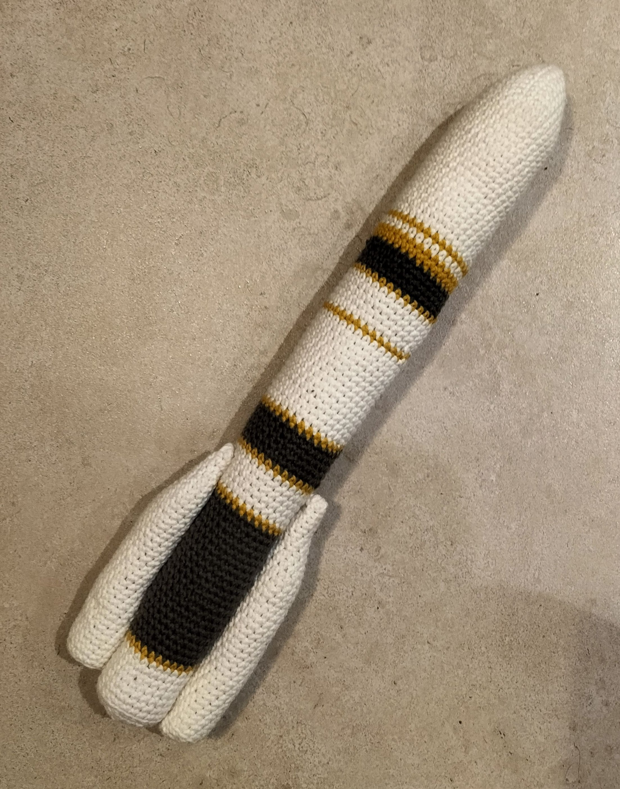

# Ariane 6

Ariane 6 est l'évolution de sa petite soeur Ariane 5 et le futur des lanceurs du centre spatial guyanais.

Vous trouverez sur cette page le patron de ma création qui s'en insipre.

# Patron Crochet Ariane 6

Ce patron permet de faire cette fusée Ariane de 44cm en version 2 ou 4 boosters

Temps nécessaire  : 8 heures

Difficulté: 1/5

## Terminologie

J'utilise des abréviation dans le patron que vous pouvez traduire en utilisant la terminologie suivante.

* rg : Rang
* ms : Mailles sérées
* aug : Agmentation
* dim : Diminution

Pour chaque rang vous trouverez le numéro du rang, ses instructions, puis entre parenthèses le nombre total de maille du rang

## Materiel

* 1 crochet taille 4
* 1 pelote blanche
* 1 pelote jaune
* 1 pelote gris foncé
* 1 paire de ciseau
* 1 aiguille à laine
* Rembourrage

Pour la laine j'utilise la Salsa de cheval blanc et un crochet de chez Prym

## Patron

### Booster (x4 ou x2)

Commencer par faire un cercle magique de 4 mailles en blanc

* Rg 1: 3 ms, 1 aug (5)
* Rg 2: 4 ms, 1 aug (6)
* Rg 3: 5 ms, 1 aug (7)
* Rg 4: 6 ms, 1 aug (8)
* Rg 5: 7 ms, 1 aug (9)
* Rg 6: 8 ms, 1 aug (10)
* Rg 7: 9 ms, 1 aug (11)
* Rg 8: 10 ms, 1 aug (12)
* Rg 9: 11 ms, 1 aug,(13)
* Rg 10: 12 ms, 1 aug (14)
* Rg 11: 13 ms, 1 aug (15)
* Rg 12: 14 ms, 1 aug (16)
* Rg 13-35: 16 ms (16)

Rembourrez bien le tube pour qu'il prenne une forme cylindrique.

* Rg 36: (1 ms, 1 dim) x 5, 1 ms (11)
* Rg 37: 5 dim (6)

Fermez et arrêtez le travail.

### Corps de la fusée

Commencer par faire un cercle magique de 6 mailles en blanc

* Rg 1 : (1 ms, 1 aug) x 3 (9)
* Rg 2 : (2 ms, 1 aug) x 3 (12)
* Rg 3 : (3 ms, 1 aug) x 3 (15)
* Rg 4 : (4 ms, 1 aug) x 3 (18)
* Rg 5 : (5 ms, 1 aug) x 3 (21)
* Rg 6 : (6 ms, 1 aug) x 3 (24)
* Rg 7 : (7 ms, 1 aug) x 3 (27)
* Rg 8 : (8 ms, 1 aug) x 3 (30)
* Rg 9 : (9 ms, 1 aug) x 3 (33)
* Rg 10-28 : 33 ms (33)

Changez de couleur pour le jaune

* Rg 29 : 33 ms (33)

Changez de couleur pour le blanc

* Rg 30 : 33 ms (33)

Changez de couleur pour le jaune

* Rg 31-32 : 33 ms (33)

Changez de couleur pour le gris foncé

* Rg 33-36 : 33 ms (33)

Changez de couleur pour le jaune

* Rg 37 : 33 ms (33)

Changez de couleur pour le blanc

* Rg 38-42 : 33 ms (33)

Changez de couleur pour le jaune

* Rg 43 : 33 ms (33)

Changez de couleur pour le blanc

* Rg 44-56 : 33 ms (33)

Changez de couleur pour le jaune

* Rg 57 : 33 ms (33)

Changez de couleur pour le gris foncé

* Rg 58-62 : 33 ms (33)

Changez de couleur pour le jaune

* Rg 63 : 33 ms (33)

Changez de couleur pour le blanc

* Rg 64-68 : 33 ms (33)

Changez de couleur pour le jaune

* Rg 69 : 33 ms (33)

Changez de couleur pour le gris foncé

* Rg 70-88 : 33 ms (33)

Changez de couleur pour le jaune

* Rg 89 : 33 ms (33)

Changez de couleur pour le blanc

* Rg 90-96 : 33 ms (33)

Rembourrez bien le tube

* Rg 97: (3 ms, 1 dim) x 6, 2ms 1 dim (26) dans le brin arrière uniquement sur tout le rang
* Rg 98: (2 ms, 1 dim) x 6, 1ms 1 dim (19)
* Rg 99: (1 ms, 1 dim) x 6, 1 dim (12)
* Rg 100: 6 dim (6)

Fermer et arrêtez le travail.

## Assemblage

Assemblez les boosters (2 ou 4) face à face l'un à l'autre au niveau de la base du corps de la fusée

Référez vous à la photo pour de la fusée assemblée pour plus de détails.

# English Version

## Ariane 6 crochet pattern

This pattern will describe how to do this Ariane 5 rocket replica that is 38cm high with 2 or 4 boosters

Time needed: 8 hours

Difficulty: 1/5

### Terminology

I use abreviates in the pattern here are them to help you read the pattern

* Rnd : Round
* sc : Single crochet
* BLO : Back loop only
* inc : Increase
* dec : Decrease

For each round you'll find the number of the round, the instructions and the total number of stiches between parenthesis

### Supplies

* 1 crochet size 4
* 1 white ball of yarn
* 1 yellow ball of yarn
* 1 dark gray gray ball of yarn
* 1 pair of cissors
* 1 yarn needle
* padding

For the wool I use the salsa onefrom cheval blanc brand and a crochet from Prym

### Pattern

#### Booster (x4 ou x2)

Start by a 4 stich magic ring in white

* Rnd 1: 3 sc, 1 inc (5)
* Rnd 2: 4 sc, 1 inc (6)
* Rnd 3: 5 sc, 1 inc (7)
* Rnd 4: 6 sc, 1 inc (8)
* Rnd 5: 7 sc, 1 inc (9)
* Rnd 6: 8 sc, 1 inc (10)
* Rnd 7: 9 sc, 1 inc (11)
* Rnd 8: 10 sc, 1 inc (12)
* Rnd 9: 11 sc, 1 inc,(13)
* Rnd 10: 12 sc, 1 inc (14)
* Rnd 11: 13 sc, 1 inc (15)
* Rnd 12: 14 sc, 1 inc (16)
* Rnd 13-35: 16 sc (16)

Stuff the tube with the padding.

* Rnd 36: (1 sc, 1 dec) x 5, 1 sc (11) BLO
* Rnd 37: 5 dec (6)

Close and stop the work.

#### Rocket body

Start by a 6 stich magic ring in white

* Rnd 1 : (1 sc, 1 inc) x 3 (9)
* Rnd 2 : (2 sc, 1 inc) x 3 (12)
* Rnd 3 : (3 sc, 1 inc) x 3 (15)
* Rnd 4 : (4 sc, 1 inc) x 3 (18)
* Rnd 5 : (5 sc, 1 inc) x 3 (21)
* Rnd 6 : (6 sc, 1 inc) x 3 (24)
* Rnd 7 : (7 sc, 1 inc) x 3 (27)
* Rnd 8 : (8 sc, 1 inc) x 3 (30)
* Rnd 9 : (9 sc, 1 inc) x 3 (33)
* Rnd 10-28 : 33 sc (33)

Change color to knit in yellow

* Rnd 29 : 33 sc (33)

Change color to knit in white

* Rnd 30 : 33 sc (33)

Change color to knit in yellow

* Rnd 31-32 : 33 sc (33)

Change color to knit in dark grey

* Rnd 33-36 : 33 sc (33)

Change color to knit in yellow

* Rnd 37 : 33 sc (33)

Change color to knit in white

* Rnd 38-42 : 33 sc (33)

Change color to knit in yellow

* Rnd 43 : 33 sc (33)

Change color to knit in white

* Rnd 44-56 : 33 sc (33)

Change color to knit in yellow

* Rnd 57 : 33 sc (33)

Change color to knit in dark grey

* Rnd 58-62 : 33 sc (33)

Change color to knit in yellow

* Rnd 63 : 33 sc (33)

Change color to knit in white

* Rnd 64-68 : 33 sc (33)

Change color to knit in yellow

* Rnd 69 : 33 sc (33)

Change color to knit in dark grey

* Rnd 70-88 : 33 sc (33)

Change color to knit in yellow

* Rnd 89 : 33 sc (33)

Change color to knit in white

* Rnd 90-96 : 33 sc (33)

Stuff the tube with the padding.

* Rnd 97: (3 sc, 1 dec) x 6, 2ms 1 dec (26) BLO
* Rnd 98: (2 sc, 1 dec) x 6, 1ms 1 dec (19)
* Rnd 99: (1 sc, 1 dec) x 6, 1 dec (12)
* Rnd 100: 6 dec (6)

Close and stop the work.

### Assembly

Attach the boosters to the side of the rocket. The booster motors must be on the bottom of the rocket body and in front of each others.

Reffer to the full rocket picture for more details.
