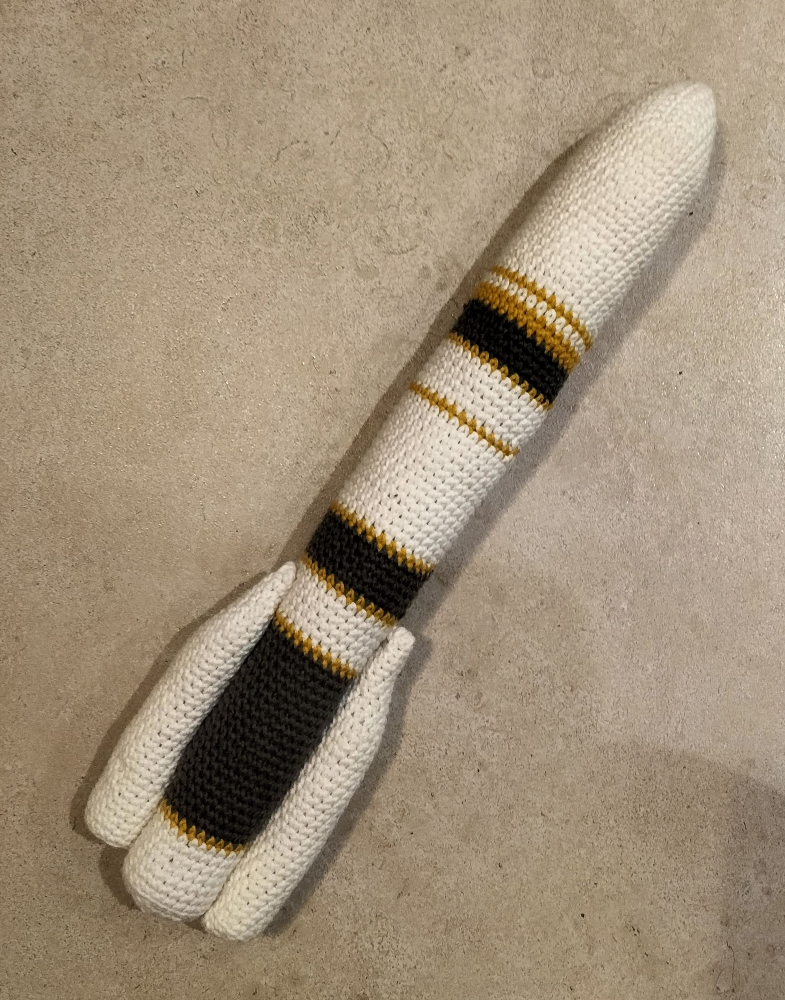
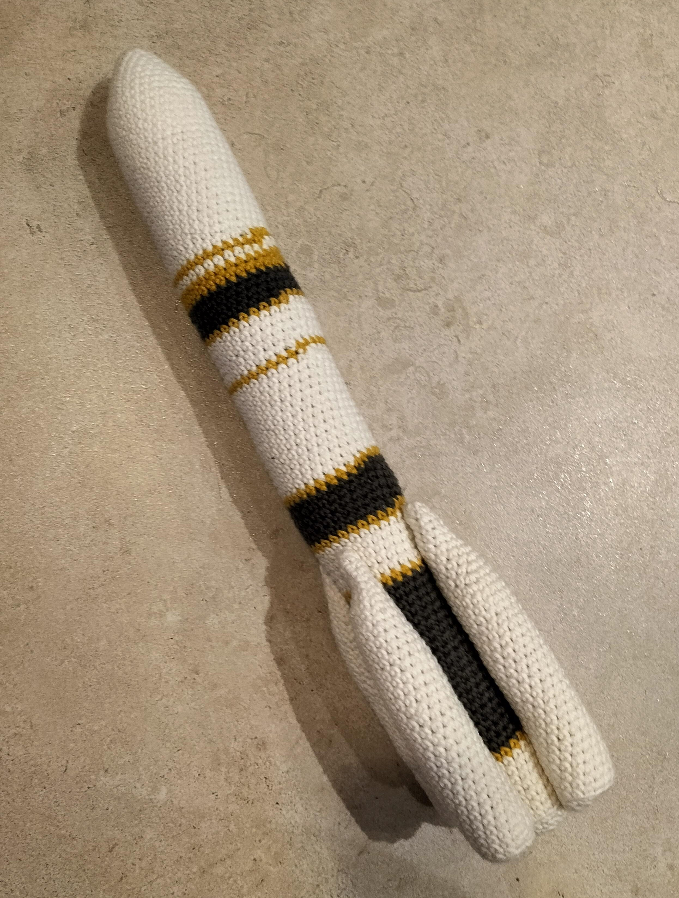
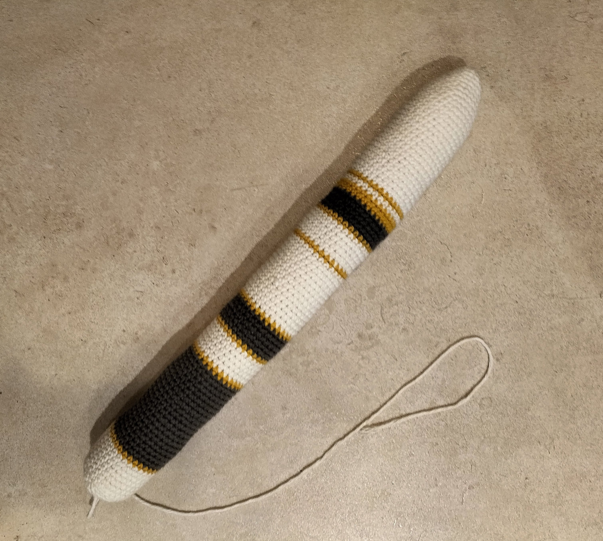

# Patron Ariane 6

Ce patron permet de faire cette fusée Ariane de 44cm en version 2 ou 4 boosters

Temps nécéssaire : 8 heures

Difficulté: 1/5

## Terminologie

J'utilise des abréviation dans le patron que vous pouvez traduire en utilisant la terminologie suivante.

* rg : Rang
* ms : Mailles sérées
* aug : Agmentation
* dim : Diminution

Pour chaque rang vous trouverez le numéro du rang, ses instructions, puis entre parenthèses le nombre total de maille du rang

## Materiel

* 1 crochet taille 4
* 1 pelotes blanche
* 1 pelote jaune
* 1 pelote gris foncé
* 1 paire de ciseau
* 1 aiguille à laine
* Rembourrage

Pour la laine j'utilise la Salsa de cheval blanc et un crochet de chez Prym

## Patron

### Booster (x4 ou x2)

Commencer par faire un cercle magique de 4 mailles en blanc

* Rg 1: 3 ms, 1 aug (5)
* Rg 2: 4 ms, 1 aug (6)
* Rg 3: 5 ms, 1 aug (7)
* Rg 4: 6 ms, 1 aug (8)
* Rg 5: 7 ms, 1 aug (9)
* Rg 6: 8 ms, 1 aug (10)
* Rg 7: 9 ms, 1 aug (11)
* Rg 8: 10 ms, 1 aug (12)
* Rg 9: 11 ms, 1 aug,(13)
* Rg 10: 12 ms, 1 aug (14)
* Rg 11: 13 ms, 1 aug (15)
* Rg 12: 14 ms, 1 aug (16)
* Rg 13-35: 16 ms (16)

Rembourrez bien le tube pour qu'il prenne une forme cylindrique.

* Rg 36: (1 ms, 1 dim) x 5, 1 ms (11)
* Rg 37: 5 dim (6)

Fermez et arrêtez le travail.

### Corps de la fusée

Commencer par faire un cercle magique de 6 mailles en blanc

* Rg 1 : (1 ms, 1 aug) x 3 (9)
* Rg 2 : (2 ms, 1 aug) x 3 (12)
* Rg 3 : (3 ms, 1 aug) x 3 (15)
* Rg 4 : (4 ms, 1 aug) x 3 (18)
* Rg 5 : (5 ms, 1 aug) x 3 (21)
* Rg 6 : (6 ms, 1 aug) x 3 (24)
* Rg 7 : (7 ms, 1 aug) x 3 (27)
* Rg 8 : (8 ms, 1 aug) x 3 (30)
* Rg 9 : (9 ms, 1 aug) x 3 (33)
* Rg 10-28 : 33 ms (33)

Changez de couleur pour le jaune

* Rg 29 : 33 ms (33)

Changez de couleur pour le blanc

* Rg 30 : 33 ms (33)

Changez de couleur pour le jaune

* Rg 31-32 : 33 ms (33)

Changez de couleur pour le gris foncé

* Rg 33-36 : 33 ms (33)

Changez de couleur pour le jaune

* Rg 37 : 33 ms (33)

Changez de couleur pour le blanc

* Rg 38-42 : 33 ms (33)

Changez de couleur pour le jaune

* Rg 43 : 33 ms (33)

Changez de couleur pour le blanc

* Rg 44-56 : 33 ms (33)

Changez de couleur pour le jaune

* Rg 57 : 33 ms (33)

Changez de couleur pour le gris foncé

* Rg 58-62 : 33 ms (33)

Changez de couleur pour le jaune

* Rg 63 : 33 ms (33)

Changez de couleur pour le blanc

* Rg 64-68 : 33 ms (33)

Changez de couleur pour le jaune

* Rg 69 : 33 ms (33)

Changez de couleur pour le gris foncé

* Rg 70-88 : 33 ms (33)

Changez de couleur pour le jaune

* Rg 89 : 33 ms (33)

Changez de couleur pour le blanc

* Rg 90-96 : 33 ms (33)

Rembourrez bien le tube

* Rg 97: (3 ms, 1 dim) x 6, 2ms 1 dim (26) dans le brin arrière uniquement sur tout le rang
* Rg 98: (2 ms, 1 dim) x 6, 1ms 1 dim (19)
* Rg 99: (1 ms, 1 dim) x 6, 1 dim (12)
* Rg 100: 6 dim (6)

Fermer et arrêtez le travail.

## Assemblage

Assemblez les boosters (2 ou 4) face à face l'un à l'autre au niveau de la base du corps de la fusée

Référez vous à la photo pour de la fusée assemblée pour plus de détails.

