# Cait Sith FF7 Rebirth

English version [here](./en/CaitSith.md)

Cait Sith est un personnage emblématique de l'univers de Final Fantasy 7 un de mes jeux de coeur de la société Square Enix

Vous trouverez sur cette page le patron de ma création qui s'en insipre.

Si vous aimez mon travail, vous pouvez me [payer de la laine](https://buymeacoffee.com/inuitcrochet){:target="_blank" rel="noopener"}

## Patron Crochet Cait Sith FF7 Rebirth

Ce patron permet de faire cet amigurumi d'environ 30cm de hauteur

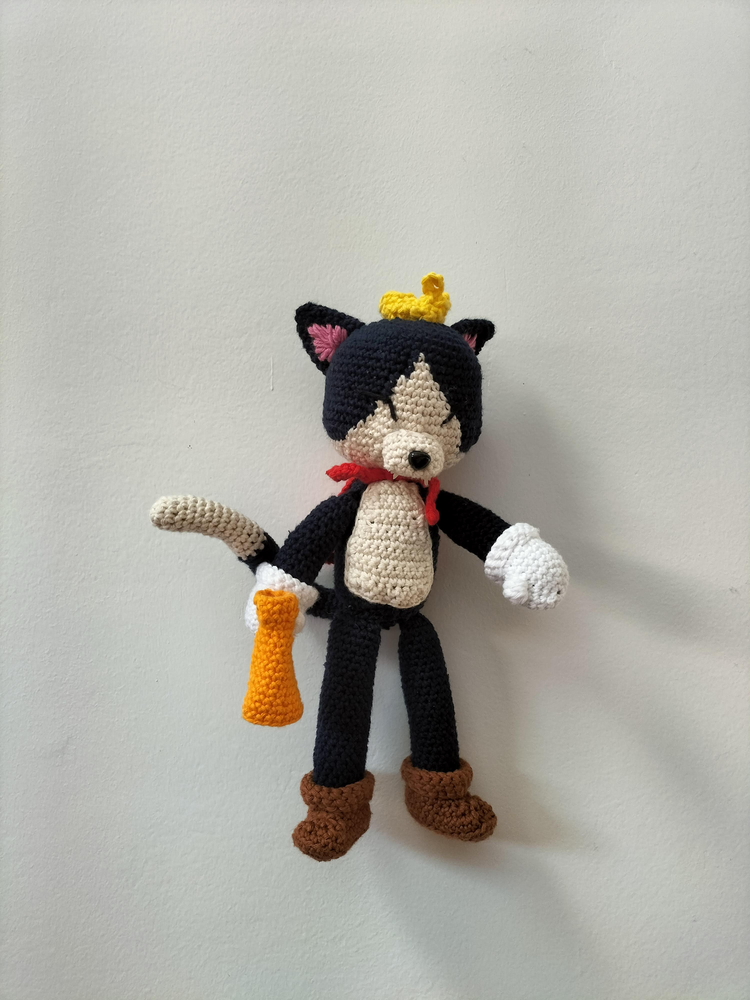

Temps nécessaire  : 13 heures

Difficulté: 3/5

### Terminologie

J'utilise des abréviation dans le patron que vous pouvez traduire en utilisant la terminologie suivante.

* rg : Rang
* ch : chaînette 
* ms : Maille sérée
* mc : Maille coulée
* aug : Agmentation
* dim : Diminution
* br : Bride

Pour chaque rang vous trouverez le numéro du rang, ses instructions, puis entre parenthèses le nombre total de maille du rang

### Materiel

* 1 crochet taille 4 ou 3,5
* 1 pelote blanche
* 1 pelote crème
* 1 pelote bleue marine
* 1 pelote noire
* 1 pelote orange
* 1 pelote rouge
* 1 pelote jaune
* 1 pelote rose
* 1 paire de ciseau
* 1 aiguille à laine
* 1 pistolet à colle
* 1 nez de sécurité (Ou du fil noir si vous voulez le broder)
* 2 mini aimants
* 2 grains de riz (Oui oui, vous verrez moi j'ai pris du riz Thaï et bio)
* Rembourrage

Pour la laine j'ai utilisé les pelotes creative cotton de chez rico design et un crochet en métal de chez Prym

## Patron

### Couronne

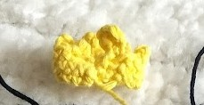

En jaune, commencez par faire chaînette de 24 mailles et fermez la pour faire un cercle

* Rg 1: 24 ms (24)
* Rg 2: 24 ms (24)
* Rg 3: (3 ch, 1 ms dans la 2e maille de la chaînette 1 mc dans la dèrnière maille de la chaînette, sautez une maille, 1 ms  x 5), 4 ch, 4 ms dans la 2e maille de la chaînette, 1 ms dans la 3e maille de la chaînette, 1 mc dans la dernière maille de la chainette, sautez une maille, 1 ms

Fermez et arrêtez le travail. Laissez du mou pour l'assemblage

### Mégaphone

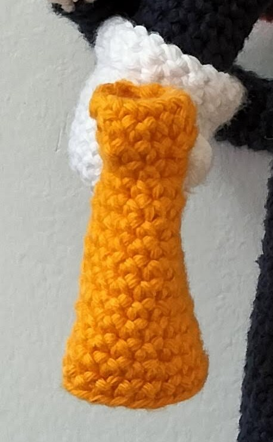

En orange, commencez par faire chaînette de 12 mailles et fermez la pour faire un cercle

* Rg 1: 12 ms (12)
* Rg 2: 12 ms (12)
* Rg 3: (2 sc, 1 dim) x 3 (9)
* Rg 4: 9 ms (9)
* Rg 5: 9 ms (9)
* Rg 6: (2 ms, 1 aug) x 3 (12)
* Rg 7: 12 ms (12)
* Rg 8: 12 ms (12)
* Rg 9: (3 ms, 1 aug) x 3 (15)
* Rg 10: 15 ms (15)
* Rg 11: 15 ms (15)
* Rg 12: (4 ms, 1 aug) x 3 (18)
* Rg 13: 18 ms (18)
* Rg 14: 18 ms (18)
* Rg 15: (5 ms, 1 aug) x 3 (21)
* Rg 16: 21 ms (21)
* Rg 17: 21 ms (21)

Fermer et arrêtez le travail.

Collez un aimant à la base du mégaphone à l'aide d'un pistolet.

### Oreilles (x2)

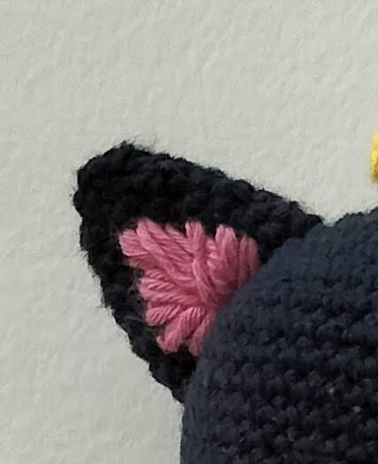

En bleu marine, commencez par faire un cercle magique de 5 mailles

* Rg 1: 5 ms (5)
* Rg 2: 5 aug (10)
* Rg 3: 10 ms (10)
* Rg 4: (1 ms, 1 aug) x 5 (15)
* Rg 5: 15ms (15)
* Rg 6: (1 ms, 1 aug, 1 ms) x 5 (20)
* Rg 7: 20 ms (15)

Fermer et arrêtez le travail. Laissez du mou pour l'assemblage

Brodez le rose à l'intérieur de l'oreille

### Cape

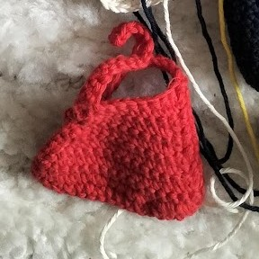

En rouge, commencez par faire chaînette de 16 mailles

Formez les rangs en allez et retours sur la chaînette de manière à faire un ouvrage plat.

* Rg 1: 16 ms (18)
* Rg 2: 1 dim, 16 ms (17)
* Rg 3: 1 dim, 15 ms (16)
* Rg 4: 1 dim, 14 ms (15)
* Rg 5: 1 dim, 13 ms (14)
* Rg 6: 1 dim, 12 ms (13)
* Rg 7: 1 dim, 11 ms (12)
* Rg 8: 1 dim, 10 ms (11)
* Rg 9: 1 dim, 9 ms (10)

Faire une chaînette de 16 mailles

* Rg 10: 15 ms dans la chaînette, 8 ms (23)

Faire une chaînette de 16 mailles

Faire 15 ms le long de la chaînette et des mailles serrées sur tous le bord de la cape

Fermer et arrêtez le travail.

### Bottes (x2)

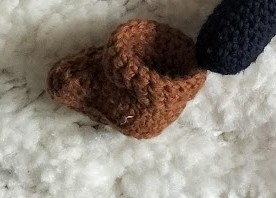

En marron, commencez par faire une chaînette de 8 mailles

* Rg 1: 1 aug dans la 2eme maille, 5 ms, 4 ms dans la dèrnière maille, 5 ms de l'autre côté de la chaînette (16)
* Rg 2: 2 aug, 5 ms, 4 aug, 5 ms, 2 aug (26)
* Rg 3: 2 aug, 10 ms, 1 aug, 1 ms, 1 aug,  10 ms, 1 aug (31)
* Rg 4: 31 ms dans le brin arrière (31)
* Rg 5: 11 ms, 2 dim, 1 ms, 2 dim, 11 ms (27)
* Rg 6: 10 ms, 5 dim, 7 ms (22)
* Rg 7: 10 ms, 2 dim, 8 ms (20)
* Rg 8 à 14: 20 ms (20)

Fermer et arrêtez le travail.

Repliez le haut de la botte pour faire un revers.

### Gants (x2)

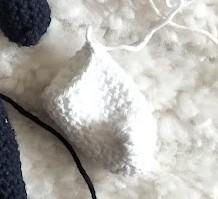
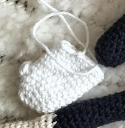

En blanc, commencez par faire un cercle magique de 6 mailles

* Rg 1: 6 aug (12)
* Rg 2: (1 ms, 1 aug) x 6 (18)
* Rg 3: 18 ms (18)
* Rg 4: 1 [point pop corn](https://www.youtube.com/watch?v=EFbZb-qawS0){:target="_blank" rel="noopener"}, 17 ms (18)
* Rg 5 à 11: 18 ms (18)

Fermer et arrêtez le travail.

Repliez le haut du gant pour faire un revers.

Sur l'un des deux collez l'autre aimant au pistolet à colle de manière à y accrocher le mégaphone

### Museau

En crème, commencez par faire une chaînette de 6 mailles

* Rg 1: à partir de la 2eme maille 4 ms, 3 ms dans la dèrnière maille, 4 ms de l'autre côté, 1 aug dans la dèrnière maille (12)
* Rg 2: 1 aug, 3 ms, 3 aug, 3 ms, 2 aug (18)
* Rg 3 à 4: 18 ms (18)

Fermer et arrêtez le travail. Laissez du mou pour l'assemblage

Fixez le nez de sécurité au milieu de l'ouvrage entre les rangs 2 et 3

Collez les grains de riz sous le museau pour faire les dents. Effet garanti.

### Bras (x2)

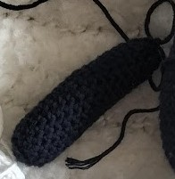

En bleu marine, commencez par faire un cercle magique de 6 mailles

* Rg 1: 6 aug (12)
* Rg 2 à 19: 12 ms (12)
* Rg 20: (2 ms, 1 dim) x 3 (9)

Fermer et arrêtez le travail. Laissez du mou pour l'assemblage

### Jambes (x2)

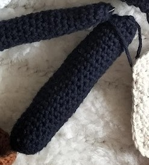

En bleu marine, commencez par faire un cercle magique de 5 mailles

* Rg 1: 5 aug (10)
* Rg 2: 1 ms, 1 aug (15)
* Rg 3 à 27: 15 ms (15)
* Rg 28: (1 ms, 1 dim) x 5 (10)

Fermer et arrêtez le travail. Laissez du mou pour l'assemblage

### Queue

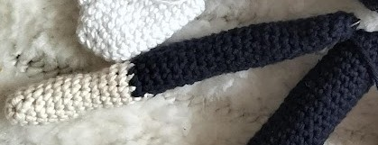

En crème, commencez par faire un cercle magique de 6 mailles

* Rg 1: 1 ms 1 aug (9)
* Rg 2 à 12: 15 ms (15)

Changez de couleur pour du bleu marine

* Rg 13 à 35: 15 ms (15)
* Rg 36: (1 ms, 1 dim) x 5 (10)

Fermer et arrêtez le travail. Laissez du mou pour l'assemblage

### Fourure du ventre

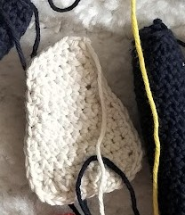

En crème, commencez par faire une chaînette de 7 mailles

Formez les rangs en allez et retours sur la chaînette de manière à faire un ouvrage plat.

* Rg 1: 7 ms (7)
* Rg 2: 1 aug, 5 ms, 1 aug (9)
* Rg 3 à 7: 9 ms (9)
* Rg 8: 1 dim, 5 ms, 1 dim (7)
* Rg 9: 1 dim, 5 ms (6)
* Rg 10: 1 dim, 4 ms (5)

Faites des mailles serrées sur tous le bord du ventre

Fermer et arrêtez le travail. Laissez du mou pour l'assemblage

### Corps

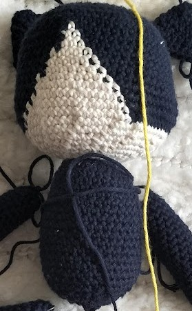

En bleu marine, commencez par faire un cercle magique de 6 mailles

* Rg 1: 6 aug (12)
* Rg 2: (1 ms, 1 aug) x6 (18)
* Rg 3: (1 ms, 1 aug, 1 ms) x6 (24)
* Rg 4: (3 ms, 1 aug) x6 (30)
* Rg 5: (2 ms, 1 aug, 2 ms) x6 (36)
* Rg 6: (5 ms, 1 aug) x6 (42)
* Rg 7: (3 ms, 1 aug, 3 ms) x6 (48)
* Rg 8: (7 ms, 1 aug) x6 (54)
* Rg 9 à 16: 54 ms (54) en veillant à respecter le schema ci dessous à partir du tour 10 pour les changements de couleur

* Rg 17: (2 ms, 1 aug) x 18 (72)
* Rg 18 à 20 : 72 ms (72) 
* Rg 21: (4 ms, 1 dim) x 12 (60)
* Rg 22: (3 ms, 1 dim) x 12 (48)
* Rg 23: (2 ms, 1 dim) x 12 (36)

Cousez le museau entre le rangs 16 et 17

Changez de couleur pour le bleu marine.

* Rg 24: (4 ms, 1 dim) x 6 (30)
* Rg 25: (3 ms, 1 dim) x 6 (24)
* Rg 26: (2 ms, 1 dim) x 6 (18)
* Rg 27: 18 ms (18)
* Rg 28: (2 ms, 1 aug) x 6 (24)
* Rg 29: (3 ms, 1 aug) x 6 (30)
* Rg 30 à 32: 30 ms (30)
* Rg 31: (4 ms, 1 aug) x 6 (36)
* Rg 32 à 43: 30 ms (36)
* Rg 21: (4 ms, 1 dim) x 6 (30)
* Rg 22: (3 ms, 1 dim) x 6 (24)
* Rg 23: (2 ms, 1 dim) x 6 (18)
* Rg 23: (1 ms, 1 dim) x 6 (12)
* Rg : 6 dim (6)

Fermer et arrêtez le travail.

## Assemblage

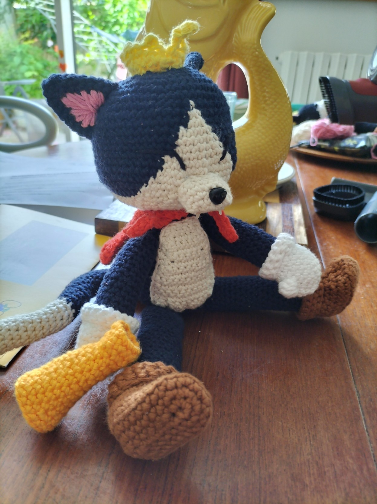

Assemblez le tout:

* Cousez les oreilles, la couronne, le ventre, les bras, les jambes et la queue au corps
* Enfilez les gants sur les bras et les bottes sur les jambes
* Collez le mégaphone à l'aide de l'aimant
* Attachez la cape autour du cou avec les chaînettes qui dépassent
* Brodez les yeux en noir
* En bonus vous pouvez insérer un fil de fer dans la queue et/ou les bras pour pouvoir les articuler

Et voilà maintenant admirez et profitez de votre merveilleux Cait Sith

