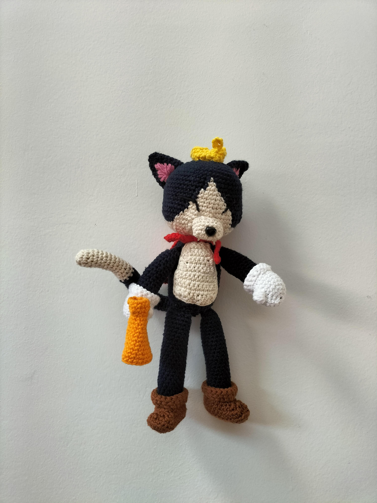
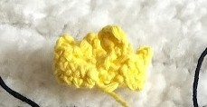
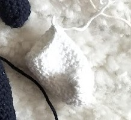
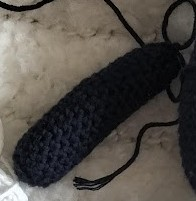

# Cait Sith FF7 Rebirth crochet pattern

This pattern will describe how to do this Ariane 5 rocket replica that is 38cm high with 2 or 4 boosters

Time needed: 13 hours

Difficulty: 3/5

If you like what I do you, you can [Buy me some yarn](https://buymeacoffee.com/inuitcrochet)

## Terminology

I use abreviates in the pattern here are them to help you read the pattern

* Rnd : Round
* ch : Chain 
* sc : Single crochet
* ss : Slip stich
* BLO : Back loop only
* inc : Increase
* dec : Decrease
* dc : Double crochet

For each round you'll find the number of the round, the instructions and the total number of stiches between parenthesis

## Supplies

* 1 crochet size 4 or 3,5
* 1 white ball of yarn
* 1 cream ball of yarn
* 1 dark blue ball of yarn
* 1 black ball of yarn
* 1 orange ball of yarn
* 1 red ball of yarn
* 1 yellow ball of yarn
* 1 pink ball of yarn
* 1 pair of cissors
* 1 yarn needle
* padding
* 1 glue gun
* 1 security nose (Or dark yarn if you want to make it this way)
* 2 mini magnets
* 2 rice grains (Yes, you'll see)

For the wool I use the creative cotton from rico design brand and a crochet from Prym

## Pattern

### Crown

Yellow, start with a 24 stich chain and close it to make a circle

* Rnd 1: 24 sc  (24)
* Rnd 2: 24 sc  (24)
* Rnd 3: (3 ch, 1 sc in 2nd stich 1 ss in the last, skip 1, 1 sc x 5), 4 ch, 4 sc in 2nd stich, 1 sc in 3rd, 1 ss in last, skip 1, 1 sc

Cut and close the work. Leave long tail for sewing

### Speaker

Orange, start with a 12 stich chain and close it to make a circle

* Rnd 1: 12 sc  (12)
* Rnd 2: 12 sc  (12)
* Rnd 3: (2 sc, 1 dec) x 3 (9)
* Rnd 4: 9 sc  (9)
* Rnd 5: 9 sc  (9)
* Rnd 6: (2 sc, 1 inc) x 3 (12)
* Rnd 7: 12 sc  (12)
* Rnd 8: 12 sc  (12)
* Rnd 9: (3 sc, 1 inc) x 3 (15)
* Rnd 10: 15 sc  (15)
* Rnd 11: 15 sc  (15)
* Rnd 12: (4 sc, 1 inc) x 3 (18)
* Rnd 13: 18 sc  (18)
* Rnd 14: 18 sc  (18)
* Rnd 15: (5 sc, 1 inc) x 3 (21)
* Rnd 16: 21 sc  (21)
* Rnd 17: 21 sc  (21)

Cut and close the work.

Glue 1 magnet with the glue gun in the narrow part of the speaker.

### Ears (x2)

dark blue, start with a 5 magic ring

* Rnd 1: 5 sc  (5)
* Rnd 2: 5 inc  (10)
* Rnd 3: 10 sc  (10)
* Rnd 4: (1 sc, 1 inc) x 5 (15)
* Rnd 5: 15 sc (15)
* Rnd 6: (1 sc, 1 inc, 1 ms) x 5 (20)
* Rnd 7: 20 sc  (15)

Cut and close the work. Leave long tail for sewing

With the sewing needle add the pink on the front of the ears.

### Cape

Red, start with a 16 chain

Crochet back and forth to make a flat thing.

* Rnd 1: 16 sc  (18)
* Rnd 2: 1 dec, 16 sc  (17)
* Rnd 3: 1 dec, 15 sc  (16)
* Rnd 4: 1 dec, 14 sc  (15)
* Rnd 5: 1 dec, 13 sc  (14)
* Rnd 6: 1 dec, 12 sc  (13)
* Rnd 7: 1 dec, 11 sc  (12)
* Rnd 8: 1 dec, 10 sc  (11)
* Rnd 9: 1 dec, 9 sc  (10)

Make a 16 chain

* Rnd 10: 15 sc in chain, 8 sc  (23)

Make a 16 chain then 15 sc in the chain and all around the cape

Cut and close the work.

### Boots (x2)

Brown, start with a chain 8

* Rnd 1: 1 inc in 2nd stitch, 5 sc, 4 sc in last stitch, 5 on sc the other side (16)
* Rnd 2: 2 inc, 5 sc, 4 inc, 5 sc, 2 inc  (26)
* Rnd 3: 2 inc, 10 sc, 1 inc, 1 sc, 1 inc,  10 sc, 1 inc  (31)
* Rnd 4: 31 sc BLO (31)
* Rnd 5: 11 sc, 2 dec, 1 sc, 2 dec, 11 sc (27)
* Rnd 6: 10 sc, 5 dec, 7 sc  (22)
* Rnd 7: 10 sc, 2 dec, 8 sc  (20)
* Rnd 8 to 14: 20 sc  (20)

Cut and close the work.

Fold the top to make it thicker

### Gloves (x2)

White, start with a 6 magic ring

* Rnd 1: 6 inc  (12)
* Rnd 2: (1 sc, 1 inc) x 6 (18)
* Rnd 3: 18 sc  (18)
* Rnd 4: 1 [pop corn stitch](https://www.youtube.com/watch?v=EFbZb-qawS0){:target="_blank" rel="noopener"}, 17 sc  (18)
* Rnd 5 to 11: 18 sc  (18)

Cut and close the work.

Fold the top to make it thicker

Glue the other magnet on one of the gloves (has to be the right hand one), you'll attache the speaker on it

### Nose

Cream,  start with a chain 6

* Rnd 1: 4 sc starting from 2nd stitch, 3 sc in last stich, 4 sc the other side,  1 inc in last stitch (12)
* Rnd 2: 1 inc, 3 sc, 3 inc, 3 sc, 2 inc  (18)
* Rnd 3 to 4: 18 sc  (18)

Cut and close the work. Leave long tail for sewing

Add the nose between round 2 and 3 in the middle

Glue the two rice grain to make the teeth. Wow effect

### Arms (x2)

Dark blue, start with a 6 magic ring

* Rnd 1: 6 inc  (12)
* Rnd 2 to 19: 12 sc  (12)
* Rnd 20: (2 sc, 1 dec) x 3 (9)

Cut and close the work.

### Legs (x2)

Dark blue, start with a 5 magic ring

* Rnd 1: 5 inc  (10)
* Rnd 2: 1 sc, 1 inc  (15)
* Rnd 3 to 27: 15 sc  (15)
* Rnd 28: (1 sc, 1 dec) x 5 (10)

Cut and close the work. Leave long tail for sewing

### Tail

Cream, start with a 6 magic ring

* Rnd 1: 1 sc  1 inc  (9)
* Rnd 2 to 12: 15 sc  (15)

Change color for dark blue

* Rnd 13 to 35: 15 sc  (15)
* Rnd 36: (1 sc, 1 dec) x 5 (10)

Cut and close the work. Leave long tail for sewing

### Belly

Creal, start with a chain 7

Crochet back and forth to make a flat thing.

* Rnd 1: 7 sc  (7)
* Rnd 2: 1 inc, 5 sc, 1 inc  (9)
* Rnd 3 to 7: 9 sc  (9)
* Rnd 8: 1 dec, 5 sc, 1 dec   (7)
* Rnd 9: 1 dec, 5 sc  (6)
* Rnd 10: 1 dec, 4 sc  (5)

Make sc all along the border

Cut and close the work. Leave long tail for sewing

### Body

Dark blue, start with a 6 magic ring

* Rnd 1: 6 inc  (12)
* Rnd 2: (1 sc, 1 inc) x6 (18)
* Rnd 3: (1 sc, 1 inc, 1 ms) x6 (24)
* Rnd 4: (3 sc, 1 inc) x6 (30)
* Rnd 5: (2 sc, 1 inc, 2 ms) x6 (36)
* Rnd 6: (5 sc, 1 inc) x6 (42)
* Rnd 7: (3 sc, 1 inc, 3 ms) x6 (48)
* Rnd 8: (7 sc, 1 inc) x6 (54)
* Rnd 9 to 16: 54 sc (54) follow the color pattern changing below

* Rnd 17: (2 sc, 1 inc) x 18 (72)
* Rnd 18 to 20 : 72 sc  (72) 
* Rnd 21: (4 sc, 1 dec) x 12 (60)
* Rnd 22: (3 sc, 1 dec) x 12 (48)
* Rnd 23: (2 sc, 1 dec) x 12 (36)

Sew the nose between round 16 and 17

Change color for dark blue.

* Rnd 24: (4 sc, 1 dec) x 6 (30)
* Rnd 25: (3 sc, 1 dec) x 6 (24)
* Rnd 26: (2 sc, 1 dec) x 6 (18)
* Rnd 27: 18 sc  (18)
* Rnd 28: (2 sc, 1 inc) x 6 (24)
* Rnd 29: (3 sc, 1 inc) x 6 (30)
* Rnd 30 to 32: 30 sc  (30)
* Rnd 31: (4 sc, 1 inc) x 6 (36)
* Rnd 32 to 43: 30 sc  (36)
* Rnd 21: (4 sc, 1 dec) x 6 (30)
* Rnd 22: (3 sc, 1 dec) x 6 (24)
* Rnd 23: (2 sc, 1 dec) x 6 (18)
* Rnd 23: (1 sc, 1 dec) x 6 (12)
* Rnd : 6 dec  (6)

## Assembly

Assembly everything like this:

* Sew the ears, crown, belly, arms, legs and tail to the body
* Put on the gloves on the arms and boots on the legs
* Attach the speaker on the glove with the magnet
* Attachez the cape around the neck with the chains
* Make the eyes with black yarn
* Bonus you can add an iron wire in the arms legs and tail to make it more strong

There you are enjoy your wonderful Cait Sith

## Licence

All my work falls under creative commons licence than you can find [here](LICENCE.md).

For more details visit (http://creativecommons.org/licenses/){:target="_blank" rel="noopener"}

To make short you are free to use, share and modify my work but not for a professional purpose. And you have to reffer my Instagram or this blog when you share it.

