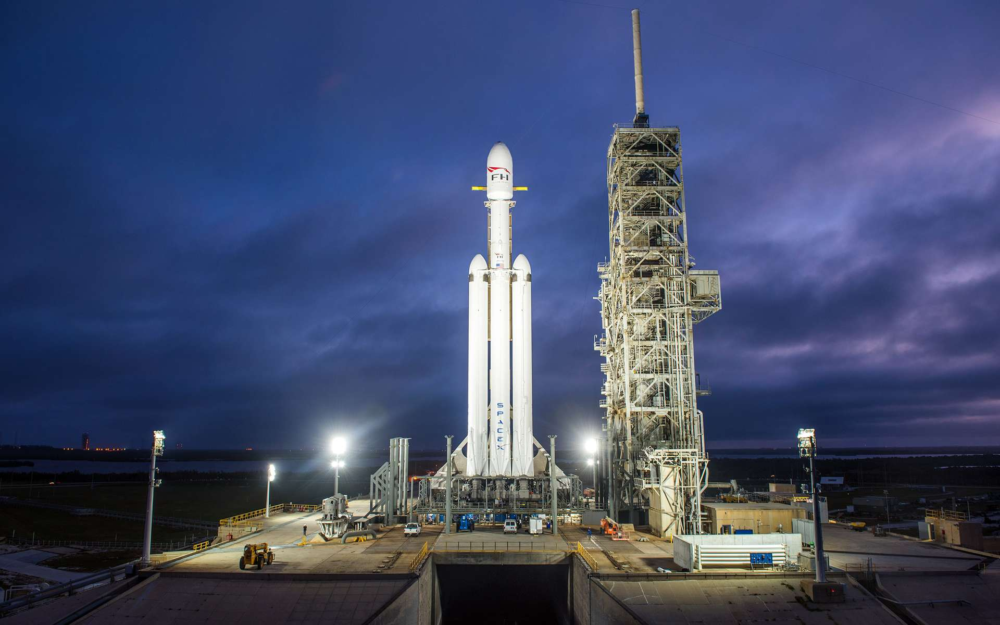
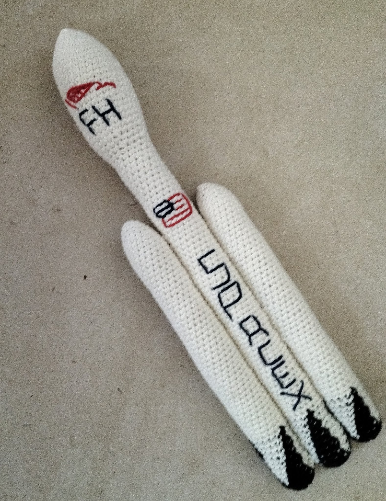
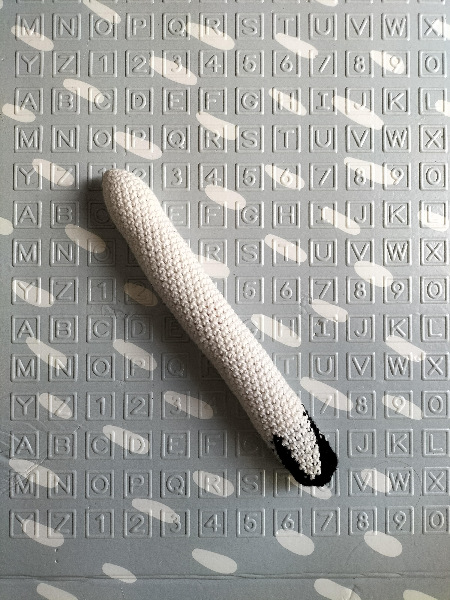
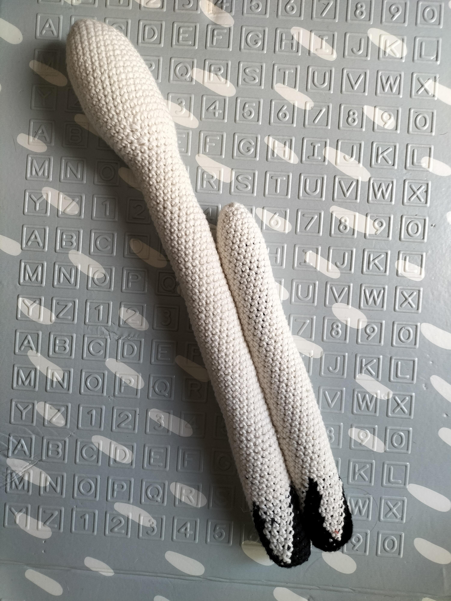
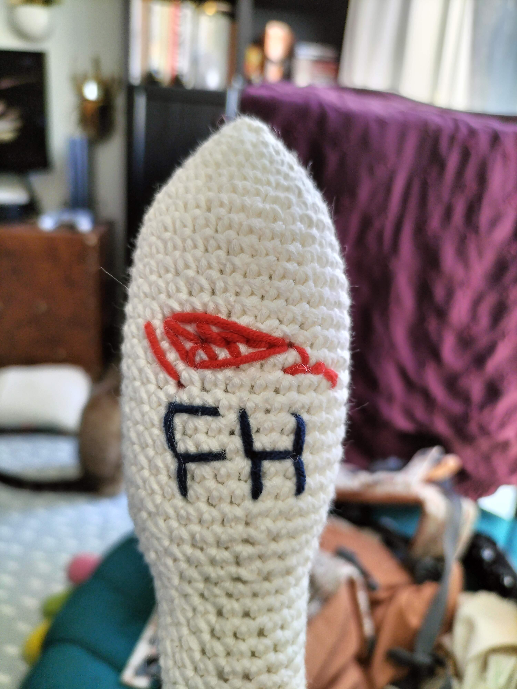

# Falcon Heavy

Falcon Heavy est la fusée du géant américain SpaceX.

Vous trouverez sur cette page les liens vers des patrons de ma création autour de celle ci.

Si vous aimez mon travail, vous pouvez me [payer de la laine](https://buymeacoffee.com/inuitcrochet)

# Patron Crochet Falcon Heavy

Ce patron permet de faire cette fusée Falcon Heavy de 40cm

Temps nécessaire  : 9 heures

Difficulté: 2/5

## Terminologie

J'utilise des abréviation dans le patron que vous pouvez traduire en utilisant la terminologie suivante.

* rg : Rang
* ms : Mailles sérées
* aug : Agmentation
* dim : Diminution

Pour chaque rang vous trouverez le numéro du rang, ses instructions, puis entre parenthèses le nombre total de maille du rang

## Materiel

* 1 crochet taille 4
* 2 pelotes blanches
* 1 pelote noires
* 1 paire de ciseau
* 1 aiguille à laine
* Rembourrage

Pour la laine j'utilise la Salsa de cheval blanc et un crochet de chez Prym

## Patron

### Corps de la fusée 

Utilisez la laine blanche

Commencez par un cercle magique de 6 mailles.

* Rg 1: (1 ms, 1 aug) x 3 (9)
* Rg 3: (3 ms, 1 aug) x 3 (15)
* Rg 2: (2 ms, 1 aug) x 3 (12)
* Rg 4: (4 ms, 1 aug) x 3 (18)
* Rg 5: (5 ms, 1 aug) x 3 (21)
* Rg 6: (6 ms, 1 aug) x 3 (24)
* Rg 7: (7 ms, 1 aug) x 3 (27)
* Rg 8: (8 ms, 1 aug) x 3 (30)
* Rg 9-21: 33 ms (30)
* Rg 22: (3 ms, 1 dim) x 6 (24)
* Rg 23: 33 ms (24)
* Rg 24: (2 ms, 1 dim) x 6 (18)

Rembourrez la coiffe de la fusée
* Rg 25-83: 18 ms (18)

Crochetez en alternant le noir et le blanc avec les deux fils
* Rg 84-85: (1 ms in black, 5 ms in white) x 3 (18)
* Rg 86-88: (2 ms in black, 4 ms in white) x 3 (18)
* Rg 89-90: (3 ms in black, 3 ms in white) x 3 (18)
* Rg 91-92: (4 ms in black, 2 ms in white) x 3 (18)
* Rg 93: (5 ms in black, 1 ms in white) x 3 (18)
* Rg 94: 18 ms in black (18)

Rembourrez le tube

Continuez en noir
* Rg 85: (3 ms, 1 dim) x 6 (24) BLO
* Rg 86: (2 ms, 1 dim) x 6 (18)
* Rg 87: (1 ms, 1 dim) x 6 (12)
* Rg 88: 6 dim (6)

Fermez et arrêtez le travail.

### Booster (x2)

Utilisez la laine blanche

Commencez par un cercle magique de 6 mailles.

* Rg 1: (1 ms, 1 aug) x 3 (9)
* Rg 3: (3 ms, 1 aug) x 3 (15)
* Rg 2: (2 ms, 1 aug) x 3 (12)
* Rg 4: (4 ms, 1 aug) x 3 (18)
* Rg 5-50: 18 ms (18)

Rembourrez le tube

Continuez en noir
* Rg 85: (3 ms, 1 dim) x 6 (24) dans le brin arrière uniquement sur tout le rang
* Rg 86: (2 ms, 1 dim) x 6 (18)
* Rg 87: (1 ms, 1 dim) x 6 (12)
* Rg 88: 6 dim (6)

Fermez et arrêtez le travail.

### Assemblage

Attachez un booster de chaque côté de la fusée pour que le bas des trois pièces soit au même niveau.

## Customisation possibles

Pour un look plus réaliste j'ai rajouté un logo, les lettrages et le drapeau américain.

# English Version

## Falcon Heavy crochet pattern

This pattern will describe how to do this Flacon Heavy rocket replica that 40cm high

Time needed: 9 hours

Difficulty: 2/5

If you like what I do you, you can [Buy me some yarn](https://buymeacoffee.com/inuitcrochet)

### Terminology

I use abreviates in the pattern here are them to help you read the pattern

* Rnd : Round
* sc : Single crochet
* BLO : Back loop only
* inc : Increase
* dec : Decrease

For each round you'll find the number of the round, the instructions and the total number of stiches between parenthesis

### Supplies

* 1 crochet size 4
* 2 white ball of yarn
* 1 black ball of yarn
* 1 pair of cissors
* 1 yarn needle
* Padding

For the wool I use the Salsa of the Cheval blanc brand and Prym crochets

### Crochet Pattern Falcon Heavy 

#### Rocket Body 

Use white yarn
Start by 6 stich a magic ring.

* Rnd 1: (1 sc, 1 inc) x 3 (9)
* Rnd 3: (3 sc, 1 inc) x 3 (15)
* Rnd 2: (2 sc, 1 inc) x 3 (12)
* Rnd 4: (4 sc, 1 inc) x 3 (18)
* Rnd 5: (5 sc, 1 inc) x 3 (21)
* Rnd 6: (6 sc, 1 inc) x 3 (24)
* Rnd 7: (7 sc, 1 inc) x 3 (27)
* Rnd 8: (8 sc, 1 inc) x 3 (30)
* Rnd 9-21: 33 sc (30)
* Rnd 22: (3 sc, 1 dec) x 6 (24)
* Rnd 23: 33 sc (24)
* Rnd 24: (2 sc, 1 dec) x 6 (18)

Stuff the top of the rocket
* Rnd 25-83: 18 sc (18)

Alternate black and white yarn using following patterns
* Rnd 84-85: (1 sc in black, 5 sc in white) x 3 (18)
* Rnd 86-88: (2 sc in black, 4 sc in white) x 3 (18)
* Rnd 89-90: (3 sc in black, 3 sc in white) x 3 (18)
* Rnd 91-92: (4 sc in black, 2 sc in white) x 3 (18)
* Rnd 93: (5 sc in black, 1 sc in white) x 3 (18)
* Rnd 94: 18 sc in black (18)

Stuff the tube with the padding.

Continue in black
* Rnd 85: (3 sc, 1 dec) x 6 (24) BLO
* Rnd 86: (2 sc, 1 dec) x 6 (18)
* Rnd 87: (1 sc, 1 dec) x 6 (12)
* Rnd 88: 6 dec (6)

Close and stop the work.

#### Booster (x2)

Start in white by a 6 stich magic ring

* Rnd 1: (1 sc, 1 inc) x 3 (9)
* Rnd 3: (3 sc, 1 inc) x 3 (15)
* Rnd 2: (2 sc, 1 inc) x 3 (12)
* Rnd 4: (4 sc, 1 inc) x 3 (18)
* Rnd 5-50: 18 sc (18)

Stuff the tube with the padding.

Continue in black
* Rnd 85: (3 sc, 1 dec) x 6 (24) BLO
* Rnd 86: (2 sc, 1 dec) x 6 (18)
* Rnd 87: (1 sc, 1 dec) x 6 (12)
* Rnd 88: 6 dec (6)

Close and stop the work.

#### Assembly

Attach the boosters on each side of the rocket body managing the bottom of each part to be at the same level.

### Possible Customizations

For a more realistic look I added Logos and an american flag.
