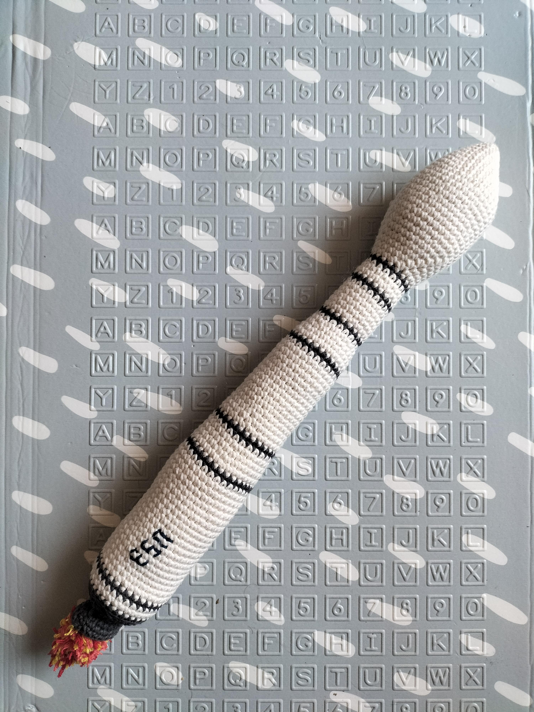

# FalconHeavy pattern

This pattern will describe how to do this FlaconHEavy rocket replica that 40cm high

Time needed: 9 hours

Difficulty: 2/5

## Terminology

I use abreviates in the pattern here are them to help you read the pattern

* Rnd : Round
* sc : Single crochet
* BLO : Back loop only
* inc : Increase
* dec : Decrease

For each round you'll find the number of the round, the instructions and the total number of stiches between parenthesis

## Supplies

* 1 crochet size 4
* 1 white ball of yarn
* 1 black gray ball of yarn
* 1 pair of cissors
* 1 yarn needle
* Padding

For the wool I use the Salsa of the Cheval blanc brand and Prym crochets

## Pattern

### Rocket Body 

Use white yarn
Start by 6 stich a magic ring.

* Rnd 1: (1 sc, 1 inc) x 3 (9)
* Rnd 3: (3 sc, 1 inc) x 3 (15)
* Rnd 2: (2 sc, 1 inc) x 3 (12)
* Rnd 4: (4 sc, 1 inc) x 3 (18)
* Rnd 5: (5 sc, 1 inc) x 3 (21)
* Rnd 6: (6 sc, 1 inc) x 3 (24)
* Rnd 7: (7 sc, 1 inc) x 3 (27)
* Rnd 8: (8 sc, 1 inc) x 3 (30)
* Rnd 9-21: 33 sc (30)
* Rnd 22: (3 sc, 1 dec) x 6 (24)
* Rnd 23: 33 sc (24)
* Rnd 24: (2 sc, 1 dec) x 6 (18)

Stuff the top of the rocket
* Rnd 25-83: 18 sc (18)

Alternate black and white yarn using following patterns
* Rnd 84-85: (1 sc in black, 5 sc in white) x 3 (18)
* Rnd 86-88: (2 sc in black, 4 sc in white) x 3 (18)
* Rnd 89-90: (3 sc in black, 3 sc in white) x 3 (18)
* Rnd 91-92: (4 sc in black, 2 sc in white) x 3 (18)
* Rnd 93: (5 sc in black, 1 sc in white) x 3 (18)
* Rnd 94: 18 sc in black (18)

Leave long white tail for assembly

Stuff the tube with the padding.

Continue in black
* Rnd 85: (3 sc, 1 dec) x 6 (24) BLO
* Rnd 86: (2 sc, 1 dec) x 6 (18)
* Rnd 87: (1 sc, 1 dec) x 6 (12)
* Rnd 88: 6 dec (6)

Close and stop the work.

### Engine

Faire le moteur en gris foncé

Use dark gray yarn
Start by 6 stich a magic ring.

* Rnd 1 : 6 inc (12)
* Rnd 2 : 12 sc (12) BLO
* Rnd 4: (4 sc, 1 inc) x 3 (18)
* Rnd 5: (5 sc, 1 inc) x 3 (21)
Close leaving long tail to be able to attach it to the rocket body

### Assembly

Attach the engine to the bottom of the rocket body.

## Possible Customizations

For a more realistic look I added pompoms to do the engine flames (with yellow, orange and red yarn)

I also added flags and logos
