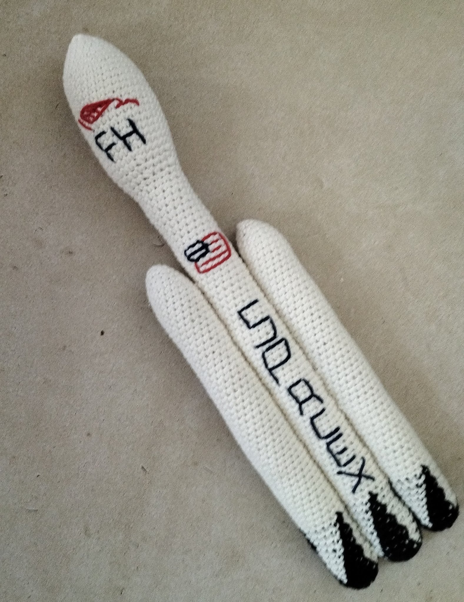
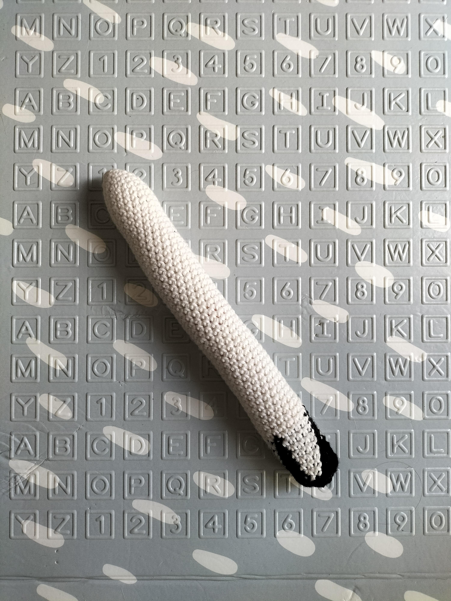
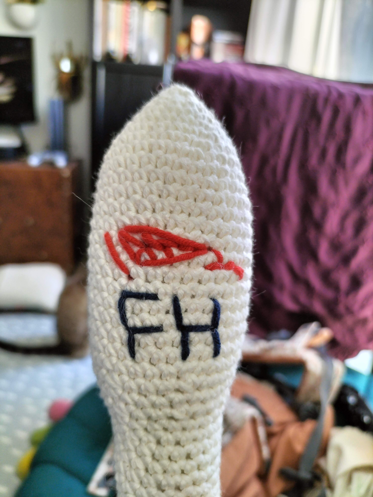

# Patron Falcon Heavy

Ce patron permet de faire cette fusée Falcon Heavy de 40cm

Temps nécessaire  : 9 heures

Difficulté: 2/5

## Terminologie

J'utilise des abréviation dans le patron que vous pouvez traduire en utilisant la terminologie suivante.

* rg : Rang
* ms : Mailles sérées
* aug : Agmentation
* dim : Diminution

Pour chaque rang vous trouverez le numéro du rang, ses instructions, puis entre parenthèses le nombre total de maille du rang

## Materiel

* 1 crochet taille 4
* 2 pelotes blanches
* 1 pelote noires
* 1 paire de ciseau
* 1 aiguille à laine
* Rembourrage

Pour la laine j'utilise la Salsa de cheval blanc et un crochet de chez Prym

## Patron

### Corps de la fusée 

Utilisez la laine blanche

Commencez par un cercle magique de 6 mailles.

* Rg 1: (1 ms, 1 aug) x 3 (9)
* Rg 3: (3 ms, 1 aug) x 3 (15)
* Rg 2: (2 ms, 1 aug) x 3 (12)
* Rg 4: (4 ms, 1 aug) x 3 (18)
* Rg 5: (5 ms, 1 aug) x 3 (21)
* Rg 6: (6 ms, 1 aug) x 3 (24)
* Rg 7: (7 ms, 1 aug) x 3 (27)
* Rg 8: (8 ms, 1 aug) x 3 (30)
* Rg 9-21: 33 ms (30)
* Rg 22: (3 ms, 1 dim) x 6 (24)
* Rg 23: 33 ms (24)
* Rg 24: (2 ms, 1 dim) x 6 (18)

Rembourrez la coiffe de la fusée
* Rg 25-83: 18 ms (18)

Crochetez en alternant le noir et le blanc avec les deux fils
* Rg 84-85: (1 ms in black, 5 ms in white) x 3 (18)
* Rg 86-88: (2 ms in black, 4 ms in white) x 3 (18)
* Rg 89-90: (3 ms in black, 3 ms in white) x 3 (18)
* Rg 91-92: (4 ms in black, 2 ms in white) x 3 (18)
* Rg 93: (5 ms in black, 1 ms in white) x 3 (18)
* Rg 94: 18 ms in black (18)

Rembourrez le tube

Continuez en noir
* Rg 85: (3 ms, 1 dim) x 6 (24) BLO
* Rg 86: (2 ms, 1 dim) x 6 (18)
* Rg 87: (1 ms, 1 dim) x 6 (12)
* Rg 88: 6 dim (6)

Fermez et arrêtez le travail.

### Booster (x2)

Utilisez la laine blanche

Commencez par un cercle magique de 6 mailles.

* Rg 1: (1 ms, 1 aug) x 3 (9)
* Rg 3: (3 ms, 1 aug) x 3 (15)
* Rg 2: (2 ms, 1 aug) x 3 (12)
* Rg 4: (4 ms, 1 aug) x 3 (18)
* Rg 5-50: 18 ms (18)

Rembourrez le tube

Continuez en noir
* Rg 85: (3 ms, 1 dim) x 6 (24) dans le brin arrière uniquement sur tout le rang
* Rg 86: (2 ms, 1 dim) x 6 (18)
* Rg 87: (1 ms, 1 dim) x 6 (12)
* Rg 88: 6 dim (6)

Fermez et arrêtez le travail.

### Assemblage

Attachez un booster de chaque côté de la fusée pour que le bas des trois pièces soit au même niveau.

## Possible Customizations

Pour un look plus réaliste j'ai rajouté un logo, les lettrages et le drapeau américain.
