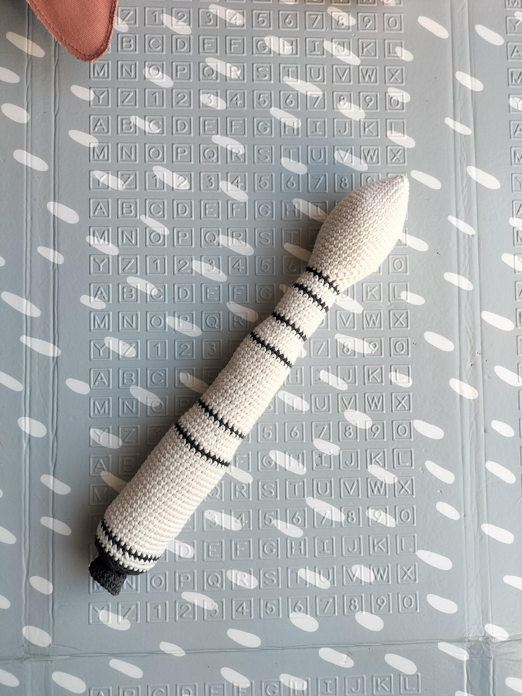

# Mascotte JO Paris 2024 (Phryge) 

English version [here](./en/Phryge.md)

La Phryge est la mascotte des JO de Paris 2024.

Vous trouverez sur cette page le patron en crochet pour réaliser celle ci.

Si vous aimez mon travail, vous pouvez me [payer de la laine](https://buymeacoffee.com/inuitcrochet){:target="_blank" rel="noopener"}

## Important

Je précise que ne suis pas l'auteur de ce patron j'ai réutilisé l'incroyable travail de lesptitesbouill Crochet que vous pouvez retrouver ici:

* [Youtube](https://www.youtube.com/channel/UCQJ15rbfX1vV65Y-zn4fREw){:target="_blank" rel="noopener"}
* [Instagram](https://www.instagram.com/lesptitesbouill_officiel/){:target="_blank" rel="noopener"}

Vous trouverez le tuto complet avec plus de détails que sur ma version sur le tutoriel pas à pas sur youtube [ici](https://www.youtube.com/watch?v=hElENmnQ77c){:target="_blank" rel="noopener"}

# Patron Phryge

Ce patron permet de faire cette Phryge 25cm

Temps nécessaire  : 7 heures

Difficulté: 2/5

## Terminologie

J'utilise des abréviation dans le patron que vous pouvez traduire en utilisant la terminologie suivante.

* rg : Rang
* ms : Mailles sérées
* aug : Agmentation
* dim : Diminution

Pour chaque rang vous trouverez le numéro du rang, ses instructions, puis entre parenthèses le nombre total de maille du rang

## Materiel

* 1 crochet taille 4
* 2 pelotes blanc cassée
* 1 pelote gris foncée
* 1 paire de ciseau
* 1 aiguille à laine
* Rembourrage

Pour la laine j'utilise la Salsa de cheval blanc et un crochet de chez Prym

## Patron

### Corps de la fusée

Commencer en blanc cassé par faire un cercle magique de 6 mailles

* Rg 1: (1 ms, 1 aug) x 3 (9)
* Rg 3: (3 ms, 1 aug) x 3 (15)
* Rg 2: (2 ms, 1 aug) x 3 (12)
* Rg 4: (4 ms, 1 aug) x 3 (18)
* Rg 5: (5 ms, 1 aug) x 3 (21)
* Rg 6: (6 ms, 1 aug) x 3 (24)
* Rg 7: (7 ms, 1 aug) x 3 (27)
* Rg 8: (8 ms, 1 aug) x 3 (30)
* Rg 9: (9 ms, 1 aug) x 3 (33)
* Rg 10-18: 33 ms (33)
* Rg 19: (9 ms, 1 dim) x 3 (30)
* Rg 20: (8 ms, 1 dim) x 3 (27)
* Rg 21: (7 ms, 1 dim) x 3 (24)
* Rg 22: (6 ms, 1 dim) x 3 (21)
* Rg 23: (5 ms, 1 dim) x 3 (18)
* Rg 24: (4 ms, 1 dim) x 3 (15)

Rembourrez bien la coiffe de la fusée

Passez en gris foncé
* Rg 25: 15 ms (15)

Repassez en blanc cassé
* Rg 26: 15 ms (15)
* Rg 27: (4 ms, 1 aug) x 3 (18)
* Rg 28: 18 ms (18)

Passez en gris foncé
* Rg 29: 18 ms (18)

Repassez en blanc cassé
* Rg 30-35: 18 ms (18)

Passez en gris foncé
* Rg 36: 18 ms (18)

Repassez en blanc cassé
* Rg 37: 18 ms (18)
* Rg 38: (5 ms, 1 aug) x 3 (21)
* Rg 39: 21 ms (21)
* Rg 40: (6 ms, 1 aug) x 3 (24)
* Rg 41: 24 ms (24)

Arrivé à mi hauteur rembourrez bien le corps de la fusée pour qu'il prenne une belle forme cylindrique.

Passez en gris foncé
* Rg 42: 24 ms (24)

Repassez en blanc cassé
* Rg 43-57: 24 ms (24)

Passez en gris foncé
* Rg 58: 24 ms (24)

Repassez en blanc cassé
* Rg 59: 24 ms (24)
* Rg 60: (7 ms, 1 aug) x 3 (27)
* Rg 61: 27 ms (27)
* Rg 62: (8 ms, 1 aug) x 3 (30)
* Rg 63: 30 ms (30)

Passez en gris foncé
* Rg 58: 30 ms (30)

Repassez en blanc cassé
* Rg 59-79: 30 ms (30)

Passez en gris foncé
* Rg 80: 30 ms (30)

Repassez en blanc cassé
* Rg 81-82: 30 ms (30)

Passez en gris foncé
* Rg 83: 30 ms (30)

Rembourrez bien la fin du tube pour qu'il prenne une belle forme cylindrique.
* Rg 84: 30 ms (30)
* Rg 85: (3 ms, 1 dim) x 6 (24) dans le brin arrière uniquement sur tout le rang
* Rg 86: (2 ms, 1 dim) x 6 (18)
* Rg 87: (1 ms, 1 dim) x 6 (12)
* Rg 88: 6 dim (6)

Fermez et arrêtez le travail.

### Moteur

Faire le moteur en gris foncé

Commencer en blanc cassé par faire un cercle magique de 6 mailles

* Rg 1 : 6 aug (12)
* Rg 2 : 12 ms (12) dans le brin arrière uniquement sur tout le rang
* Rg 4: (4 ms, 1 aug) x 3 (18)
* Rg 5: (5 ms, 1 aug) x 3 (21)

Fermez et arrêtez le travail laissez un long fil pour attacher à la fusée.

### Assemblage

Attachez le moteur sous la fusée en plein centre.

## Customisations possibles

Pour un rendu moins simpliste j'y ai ajouté des pompons en bout du moteur pour faire des flammes (Avec un mélange de laine rouge orange et jaune)

J'ai aussi brodé des motifs de logo ESA pour être plus fidèle à l'originale

