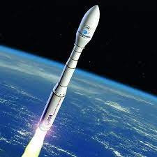

# VegaC

La fusée VegaC est le micro lanceur du centre spatial guyanais.

Vous trouverez sur cette page les liens vers des patrons de ma création autour de celle ci.

## Patron

Patron fusée VegaC.

* [Français](./fr/VegaC.md)
* [Anglais](./en/VegaC.md)

# English version

VegaC is the micro rocket operated byt the centre spatial guyanais.

You'll find on this page crochet patterns I made for this

## First version

VegaC pattern.

* [French](./fr/VegaC.md)
* [English](./en/VegaC.md)
