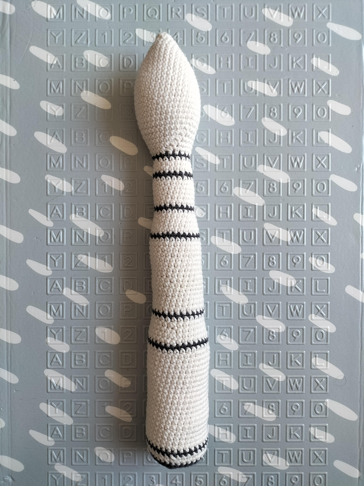

# VegaC

La fusée VegaC est le micro lanceur du centre spatial guyanais.

Vous trouverez sur cette page les liens vers des patrons de ma création autour de celle ci.

# Patron crochet VegaC

Ce patron permet de faire cette fusée VegaC d'environ 40cm

Temps nécessaire  : 5 heures

Difficulté: 1/5

## Terminologie

J'utilise des abréviation dans le patron que vous pouvez traduire en utilisant la terminologie suivante.

* rg : Rang
* ms : Mailles sérées
* aug : Agmentation
* dim : Diminution

Pour chaque rang vous trouverez le numéro du rang, ses instructions, puis entre parenthèses le nombre total de maille du rang

## Materiel

* 1 crochet taille 4
* 2 pelotes blanc cassée
* 1 pelote gris foncée
* 1 paire de ciseau
* 1 aiguille à laine
* Rembourrage

Pour la laine j'utilise la Salsa de cheval blanc et un crochet de chez Prym

## Patron

### Corps de la fusée

Commencer en blanc cassé par faire un cercle magique de 6 mailles

* Rg 1: (1 ms, 1 aug) x 3 (9)
* Rg 3: (3 ms, 1 aug) x 3 (15)
* Rg 2: (2 ms, 1 aug) x 3 (12)
* Rg 4: (4 ms, 1 aug) x 3 (18)
* Rg 5: (5 ms, 1 aug) x 3 (21)
* Rg 6: (6 ms, 1 aug) x 3 (24)
* Rg 7: (7 ms, 1 aug) x 3 (27)
* Rg 8: (8 ms, 1 aug) x 3 (30)
* Rg 9: (9 ms, 1 aug) x 3 (33)
* Rg 10-18: 33 ms (33)
* Rg 19: (9 ms, 1 dim) x 3 (30)
* Rg 20: (8 ms, 1 dim) x 3 (27)
* Rg 21: (7 ms, 1 dim) x 3 (24)
* Rg 22: (6 ms, 1 dim) x 3 (21)
* Rg 23: (5 ms, 1 dim) x 3 (18)
* Rg 24: (4 ms, 1 dim) x 3 (15)

Rembourrez bien la coiffe de la fusée

Passez en gris foncé
* Rg 25: 15 ms (15)

Repassez en blanc cassé
* Rg 26: 15 ms (15)
* Rg 27: (4 ms, 1 aug) x 3 (18)
* Rg 28: 18 ms (18)

Passez en gris foncé
* Rg 29: 18 ms (18)

Repassez en blanc cassé
* Rg 30-35: 18 ms (18)

Passez en gris foncé
* Rg 36: 18 ms (18)

Repassez en blanc cassé
* Rg 37: 18 ms (18)
* Rg 38: (5 ms, 1 aug) x 3 (21)
* Rg 39: 21 ms (21)
* Rg 40: (6 ms, 1 aug) x 3 (24)
* Rg 41: 24 ms (24)

Arrivé à mi hauteur rembourrez bien le corps de la fusée pour qu'il prenne une belle forme cylindrique.

Passez en gris foncé
* Rg 42: 24 ms (24)

Repassez en blanc cassé
* Rg 43-57: 24 ms (24)

Passez en gris foncé
* Rg 58: 24 ms (24)

Repassez en blanc cassé
* Rg 59: 24 ms (24)
* Rg 60: (7 ms, 1 aug) x 3 (27)
* Rg 61: 27 ms (27)
* Rg 62: (8 ms, 1 aug) x 3 (30)
* Rg 63: 30 ms (30)

Passez en gris foncé
* Rg 58: 30 ms (30)

Repassez en blanc cassé
* Rg 59-79: 30 ms (30)

Passez en gris foncé
* Rg 80: 30 ms (30)

Repassez en blanc cassé
* Rg 81-82: 30 ms (30)

Passez en gris foncé
* Rg 83: 30 ms (30)

Rembourrez bien la fin du tube pour qu'il prenne une belle forme cylindrique.
* Rg 84: 30 ms (30)
* Rg 85: (3 ms, 1 dim) x 6 (24) dans le brin arrière uniquement sur tout le rang
* Rg 86: (2 ms, 1 dim) x 6 (18)
* Rg 87: (1 ms, 1 dim) x 6 (12)
* Rg 88: 6 dim (6)

Fermez et arrêtez le travail.

### Moteur

Faire le moteur en gris foncé

Commencer en blanc cassé par faire un cercle magique de 6 mailles

* Rg 1 : 6 aug (12)
* Rg 2 : 12 ms (12) dans le brin arrière uniquement sur tout le rang
* Rg 4: (4 ms, 1 aug) x 3 (18)
* Rg 5: (5 ms, 1 aug) x 3 (21)

Fermez et arrêtez le travail laissez un long fil pour attacher à la fusée.

### Assemblage

Attachez le moteur sous la fusée en plein centre.

## Customisations possibles

Pour un rendu moins simpliste j'y ai ajouté des pompons en bout du moteur pour faire des flammes (Avec un mélange de laine rouge orange et jaune)

J'ai aussi brodé des motifs de logo ESA pour être plus fidèle à l'originale

# English Version

## VegaC crochet pattern

This pattern will describe how to do this VegaC rocket replica that 40cm high

Time needed: 5 hours

Difficulty: 1/5

### Terminology

I use abreviates in the pattern here are them to help you read the pattern

* Rnd : Round
* sc : Single crochet
* BLO : Back loop only
* inc : Increase
* dec : Decrease

For each round you'll find the number of the round, the instructions and the total number of stiches between parenthesis

### Supplies

* 1 crochet size 4
* 2 white ball of yarn
* 1 dark gray ball of yarn
* 1 pair of cissors
* 1 yarn needle
* Padding

For the wool I use the Salsa of the Cheval blanc brand and Prym crochets

### Pattern

#### Rocket Body 

Use white yarn
Start by 6 stich a magic ring.

* Rnd 1: (1 sc, 1 inc) x 3 (9)
* Rnd 3: (3 sc, 1 inc) x 3 (15)
* Rnd 2: (2 sc, 1 inc) x 3 (12)
* Rnd 4: (4 sc, 1 inc) x 3 (18)
* Rnd 5: (5 sc, 1 inc) x 3 (21)
* Rnd 6: (6 sc, 1 inc) x 3 (24)
* Rnd 7: (7 sc, 1 inc) x 3 (27)
* Rnd 8: (8 sc, 1 inc) x 3 (30)
* Rnd 9: (9 sc, 1 inc) x 3 (33)
* Rnd 10-18: 33 sc (33)
* Rnd 19: (9 sc, 1 dec) x 3 (30)
* Rnd 20: (8 sc, 1 dec) x 3 (27)
* Rnd 21: (7 sc, 1 dec) x 3 (24)
* Rnd 22: (6 sc, 1 dec) x 3 (21)
* Rnd 23: (5 sc, 1 dec) x 3 (18)
* Rnd 24: (4 sc, 1 dec) x 3 (15)

Stuff the top of the rocket

Use dark gray yarn
* Rnd 25: 15 sc (15)

Use white yarn
* Rnd 26: 15 sc (15)
* Rnd 27: (4 sc, 1 inc) x 3 (18)
* Rnd 28: 18 sc (18)

Use dark gray yarn
* Rnd 29: 18 sc (18)

Use white yarn
* Rnd 30-35: 18 sc (18)

Use dark gray yarn
* Rnd 36: 18 sc (18)

Use white yarn
* Rnd 37: 18 sc (18)
* Rnd 38: (5 sc, 1 inc) x 3 (21)
* Rnd 39: 21 sc (21)
* Rnd 40: (6 sc, 1 inc) x 3 (24)
* Rnd 41: 24 sc (24)

Now that you are in the middle Stuff the tube with the padding.

Use dark gray yarn
* Rnd 42: 24 sc (24)

Use white yarn
* Rnd 43-57: 24 sc (24)

Use dark gray yarn
* Rnd 58: 24 sc (24)

Use white yarn
* Rnd 59: 24 sc (24)
* Rnd 60: (7 sc, 1 inc) x 3 (27)
* Rnd 61: 27 sc (27)
* Rnd 62: (8 sc, 1 inc) x 3 (30)
* Rnd 63: 30 sc (30)

Use dark gray yarn
* Rnd 58: 30 sc (30)

Use white yarn
* Rnd 59-79: 30 sc (30)

Use dark gray yarn
* Rnd 80: 30 sc (30)

Use white yarn
* Rnd 81-82: 30 sc (30)

Use dark gray yarn
* Rnd 83: 30 sc (30)

Stuff the tube with the padding.
* Rnd 84: 30 sc (30)
* Rnd 85: (3 sc, 1 dec) x 6 (24) BLO
* Rnd 86: (2 sc, 1 dec) x 6 (18)
* Rnd 87: (1 sc, 1 dec) x 6 (12)
* Rnd 88: 6 dec (6)

Close and stop the work.

#### Engine

Faire le moteur en gris foncé

Use dark gray yarn

Start by 6 stich a magic ring.

* Rnd 1 : 6 inc (12)
* Rnd 2 : 12 sc (12) BLO
* Rnd 4: (4 sc, 1 inc) x 3 (18)
* Rnd 5: (5 sc, 1 inc) x 3 (21)

Close leaving long tail to be able to attach it to the rocket body

#### Assembly

Attach the engine to the bottom of the rocket body.

### Possible Customizations

For a more realistic look I added pompoms to do the engine flames (with yellow, orange and red yarn)

I also added flags and logos
